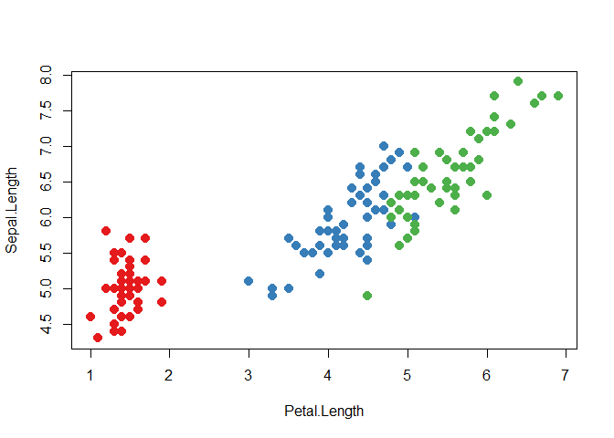

19.1 Introduction
-----------------

이제 R 코드의 tree 구조에 대해 이해를 했으니, <br />   `expr()`나 `ast()`가 work하는 원리에 대해 알아보자: 바로 quotation. <br /> tidy evaluation에서, 모든 quoting 함수는 사실 quasiquoting 함수다. <br /> 왜냐하면 unquoting 또한 지원하기 때문.

quotation은 unevaluated expression을 캡처링하는 act인데 비해, <br />   unquotation은 quoted expression이었을 부분을 선택적으로 evaluate하는 그런 기능. <br /> 이걸 다 합쳐서 quasiquotation이라고 함. <br /> quasiquotation은 어떤 함수를 create하는 것을 쉽게 만들어준다. <br />   어떤 함수? 함수 작성자author가 만든 코드와 함수 사용자user가 만든 코드를 결합combine해주는 함수. <br /> 이게 넓은 범위의 어려운 문제들을 해결해준다.

quasiquotation은 tidy evaluation의 3가지 기둥 중 하나다. <br /> 나머지 둘인 quosures와 data mask에 대해서는 Chapter 20에서 배울 것.

홀로 사용했을 때에는, quasiquotation은 가장 유용한 프로그래밍. <br /> 특히나 코드를 만드는데generating 있어서. <br /> 하지만 다른 테크닉들과 결합되면, tidy evaluation은 data analysis를 위한 강력한 툴이 된다.

### Outline

-   Section 19.2에서는 quasiquotation의 개발 동기가 되는 함수, `cement()`에 대해 알아봄. <br />   `paste()`와 비슷하게 작동하지만, 자동으로 함수 인자들을 따옴표quote해주기 때문에, 직접 안 해도 된다.

-   Section 19.3에서는 expressions를 quote하는 도구를 준다. <br />   그 expression을 작성자가 만들었든 사용자가 만들었든, rlang을 사용하든 base R을 사용하든.

-   Section 19.4에서는, rlang quoting 함수와 base quoting 함수 간의 가장 큰 차이점을 소개한다.: <br />   `!!`로 unquoting하는 것과 `!!!`로 unquoting하는 것.

-   Section 19.5에서는, quoting하는 동작을 비활성화disable하는데 base R 함수들이 사용하는, <br />   3개의 주요 non-quoting 테크닉들을 다룬다.

-   Section 19.6에서는, `!!!`을 사용할 수 있는 또 다른 장소, `...`을 받는 함수에 대해 알아본다. <br />   또, 특별한 연산자인 `:=`를 소개하는데, 얘는 인자 이름argument names을 다이나믹하게 바꿀 수 있도록 해준다.

-   Section 19.7에서는, 몇몇 코드 생성을 자연적으로 필요로 하는 문제를 해결하는데 있어, <br />   quoting의 실용적인 사용법 몇 개를 보여준다.

-   Section 19.8에서는, quasiquotation에 대해 짧은 역사로 마무리. 혹시나 누군가 궁금해할까봐...

### Prerequisites

동기 부여에 대한 전체적인 개요와 기본적인 단어들을 위해, [Chapter 17](https://blog-for-phil.readthedocs.io/en/latest/Advanced%20R/17-Big-Picture/), metaprogramming overview를 읽고 오자. <br /> 그리고 [Section 18.3](https://blog-for-phil.readthedocs.io/en/latest/Advanced%20R/18-Expressions/#183-expressions)에 설명되어 있는, expression의 tree 구조에 친숙해야 한다.

코드 측면에서는, 대부분의 경우, rlang에 있는 툴들을 사용할 것이다. <br /> 하지만 chapter의 끝 부분에서, purrr과 연동해 강력한 응용을 보게 될 것이다.

``` r
library(rlang)
library(purrr)
```

### Related work

quoting 함수들은, Lisp **macros**와 깊은 관련이 있다. <br /> 하지만 macros는 보통 컴파일-타임에 실행되는데, R에는 이게 존재하지 않는다. <br /> 그리고 항상 input이랑 output이 AST다. 이걸 R에다가 구현하려는 접근법으로는 Lumley([2001](https://www.r-project.org/doc/Rnews/Rnews_2001-3.pdf))를 참고해라. <br /> quoting 함수들은, 소수만 아는, Lisp의 fexprs와 더 밀접한 연관이 있는데, 이 함수들은, 모든 인자들을 디폴트로 quote한다. <br /> 이 용어들은, 다른 프로그래밍 언어에서 연관된 작업related work을 찾아볼 때, 유용하다.

------------------------------------------------------------------------

19.2 Motivation
---------------

unquoting의 필요성을 보여주는, 구체적인 예시와 함께 시작해보자. <br /> 결국엔 이게 quasiquotation으로 연결. <br /> words를 joining함으로써 strings를 만든다고 상상해보자.

``` r
paste("Good", "morning", "Hadley")
## [1] "Good morning Hadley"
paste("Good", "afternoon", "Alice")
## [1] "Good afternoon Alice"
```

이렇게 따옴표quotes를 다 넣는건 지루하다. 그냥 생 단어bare words를 사용하고 싶다. <br /> 그러고 싶다면, 다음의 함수를 사용하면 된다. <br /> (각 조각들에 대해선 걱정하지마라. 나중에 배울 것이다.)

``` r
cement <- function(...) {
    args <- ensyms(...)
    paste(purrr::map(args, as_string), collapse = " ")
}
```

``` r
cement(Good, morning, Hadley)
## [1] "Good morning Hadley"
cement(Good, afternoon, Alice)
## [1] "Good afternoon Alice"
```

형식적으로, 이 함수는 모든 인풋들을 따옴표quote해준다. <br /> 자동적으로 각 인자argument에다가 따옴표를 넣어준다고 생각할 수도 있는데, <br /> 그건 정확한 사실은 아니다. 왜냐하면 중간 결과물들이 expression이지, string이 아니기 때문. <br /> 하지만 여전히 유용한 근사치approximations이긴하다. <br /> 그리고 이게 "quote"라는 용어의 근본적인 의미기도 하고.

이 함수는 더 이상 따옴표를 하나하나 안 쳐도 된다는 점에서 nice하다. <br /> 하지만 문제는, variables를 사용하고 싶을 때 발생한다. <br /> `paste()` 때는 variables 사용하기 쉬웠다. 그냥 따옴표를 안치면 됐으니깐.

``` r
name <- "Hadley"
time <- "morning"

paste("Good", time, name)
## [1] "Good morning Hadley"
```

당연히, `cement()`에서는 안 된다. 왜냐하면 모든 input들을 자동적으로 quote하기 때문.

``` r
cement(Good, time, name)
## [1] "Good time name"
```

input을 명백하게explicitly, unquote할 방법이 필요하다. <br /> `cement()`라는 함수가 자동적인 따옴표 치는 걸 막아줄 그런 방법. <br /> 여기선 , `time`과 `name`을, `Good`과는 다르게 다루어줘야 한다.

quasiquotation은 이걸 할 수 있는 방법을 준다. <br /> `!!`, unquote라고 불리는 기본적인 도구. 뱅뱅이라고 부름. <br /> 이건 quoting 함수에게 quote하지 말 것을 전달해준다.

``` r
cement(Good, !!time, !!name)
## [1] "Good morning Hadley"
```

`cement()`와 `paste()`를 직접적으로 비교하는건 유용하다. <br /> `paste()`는 인자들arguments을 evaluate하기 때문에, quote가 필요하면 해줘야 함. <br /> `cement()`는 인자들arguments을 quote하기 때문에, unquote가 필요하면 해줘야 한다.

``` r
paste("Good", time, name)
cement(Good, !!time, !!name)
```

### 19.2.1 Vocabulary

quote된 인자들arguments과, evaluate된 인자들을 구분하는 것은 중요하다.

-   evaluate된 인자들은 R의 usual evaluation rule을 따른다.

-   quote된 인자들은 함수에 의해 캡처된 것으로, 몇몇 커스텀 방법으로 처리됨.

`paste()`는 모든 인자들을 evaluate하고, `cement()`는 모든 인자들을 quote한다.

어떤 인자가 quote된건지 evaluate된건지 확신이 없다면, 코드를 함수 밖에서 실행해보라. <br /> 만약에 작동하지 않는다거나, 다른 행동을 한다면, 인자는 quote된 것. <br /> 예를 들어서, `library()`에서 첫 번째 인자는 quote일까, evaluate일까?

``` r
# 작동됨
library(MASS)

# 안 됨
MASS
## Error in eval(expr, envir, enclos): 객체 'MASS'를 찾을 수 없습니다
#> Error ...
```

그러니깐 quote되어 있는 것임.

인자가 quote된건지 evaluate된건지에 대해 말하는 것은, <br />   함수가 non-standard evaluation(NSE)를 사용하는것인지 아닌지를, <br /> 좀 더 정확하게 나타내는 것.

난 가끔, 하나 혹은 여러 개의 인자들을 quotes하는 함수들을, 짧게 quoting function이라고 부를 것이다. <br /> 하지만 일반적으로, quoted 인자들에 대해 얘기할 것이다. <br />   왜냐하면 거기서부터 차이가 발생하는 것이기 때문.

### 19.2.2 Exercises

------------------------------------------------------------------------

19.3 Quoting
------------

quasiquotation의 첫 번째 파트는 quotation이다. <br />   expression을 evaluate하지 않고 캡쳐하는 것.

expression이 직접적으로 혹은 간접적으로 공급될 수 있기 때문에, 2개의 함수들이 필요하다. <br />   공급되는supplied 것은 lazily-evaluated function argument를 통해서. <br /> We'll need a pair of functions / because the expression can be supplied directly or indirectly, <br />   via lazily-evaluated function argument. <br /> rlang 패키지의 quoting 함수들로 시작해보자. 그러고나서 base R로 돌아오자.

### 19.3.1 Capturing expressions

4개의 중요한 quoting 함수들이 있다. <br /> 인터랙티브한 탐구를 할 때, 가장 중요한건 `expr()`이다. <br /> 얘는 인자argument를 공급받은 그대로 캡쳐해준다.

``` r
expr(x + y)
## x + y

expr(1 / 2 / 3)
## 1/2/3
```

(띄어쓰기나 코멘트는 expression의 부분이 아니기 때문에, <br />   quoting 함수에 의해 캡쳐되지 않는다는 걸 기억하자.)

`expr()`은 인터랙티브한 탐구를 하기에 좋다. <br /> 왜냐하면, 개발자가 타입한 걸 캡쳐해 준다는 점에서 쓸모가 많음. <br /> 함수 내에서는 별로 쓸모가 없음. It's not so useful inside a function.

``` r
f1 <- function(x) expr(x)
f1(a + b + c)
## x
```

이 문제를 해결하기 위해서는 다른 함수가 필요함. `enexpr()` <br /> 이 함수는 함수 호출자caller가 함수에 제공한 것을 캡쳐해준다. <br />   어떻게? lazy evaluation을 작동시키는 internal promise object를 찾아봄으로써.([Section 6.5.1](https://blog-for-phil.readthedocs.io/en/latest/Advanced%20R/06-Functions/#651-promises)) <br /> This captures what the caller supplied to the function <br />   by looking at the internal promise object that powers lazy evaluation.

``` r
f2 <- function(x) enexpr(x)
f2(a + b + c)
## a + b + c
```

여기서 en은 enrich의 en이다. 더 풍부하게 한다는 의미.

`...`에 있는 모든 인자들arguments을 캡쳐하기 위해서는, `enexprs()`를 사용해야 한다.

``` r
f <- function(...) enexprs(...)
f(x = 1, y = 10 * z)
## $x
## [1] 1
## 
## $y
## 10 * z
```

마지막으로, `exprs()`는 인터랙티브하게 expressions의 리스트를 만드는데 유용.

``` r
exprs(x = x ^ 2, y = y ^ 3, z = z ^ 4)
## $x
## x^2
## 
## $y
## y^3
## 
## $z
## z^4
```

이건 이것과 같은 것임. <br /> `list(x = expr(x ^ 2), y = expr(y ^ 3), z = expr(z ^ 4))`

요약해보면, `enexpr()`과 `enexprs()`는 사용자에 의해 제공된 arguments들을 캡쳐하는데 사용. <br />   to capture the expressions supplied as arguments by the user <br /> `expr()`과 `exprs()`는 니가 공급한 expressions를 캡쳐할 때 사용. <br />   to capture expressions that you supply

### 19.3.2 Capturing symbols

가끔, 사용자가 임의의 expression이 아닌, 변수 이름variable name만을 정하도록 하고 싶을 수 있다. <br /> 이럴 때에는 `ensym()`이나 `ensyms()`를 이용하면 된다.

이것들은 `enexpr()`과 `enexprs()`의 변형variant이다. <br /> 얘들은, 캡쳐된 expression이 symbol이나 string인지를 체크해줌.(string의 경우에는 symbol로 변환됨) <br /> 만약 다른거라면, 에러를 낸다.

``` r
f <- function(...) ensyms(...)
f(x)
## [[1]]
## x
f("x")
## [[1]]
## x
```

### 19.3.3 With base R

위의 각 rlang 함수들은, base R에 동일한 것들이 다 있다. <br /> 가장 큰 차이점은, base R에 있는 것들은 unquoting을 지원하지 않는다는 것.(곧 다룰 것) <br /> 그래서 base R의 것들은 quoting functions이다. quasiquoting functions가 아니라.

`expr()`의 base 버전은 `quote()`다.

``` r
quote(x + y)
## x + y
```

`enexpr()`의 가장 가까운 base 버전은 `substitute()`

``` r
f3 <- function(x) substitute(x)
f3(x + y)
## x + y
```

`exprs()`의 가장 가까운 base 버전은 `alist()`

``` r
alist(x = 1, y = x + 2)
## $x
## [1] 1
## 
## $y
## x + 2
```

`enexprs()`의 가장 가까운 base 버전은 `substitute()`에 써져있지는 않은 기능.

``` r
f <- function(...) as.list(substitute(...()))
f(x = 1, y = 10 * z)
## $x
## [1] 1
## 
## $y
## 10 * z
```

두 개의 또 다른 중요한 base quoting 함수들이 있다. <br /> - `bquote()`는 quasiquotation의 제한된 형식limited form을 제공해준다. [Section 19.5]()에서 다룸. <br /> - `~`, formula는 environment도 캡쳐하는 quoting function. 이건 quosure의 영감이 되었다. <br /> Chapter 20의 주제이고, Section 20.3.4에서 다룬다.

### 19.3.4 Substitution

`substitute()`를, unevaluated arguments를 캡쳐하는데 쓰는걸 자주 볼 것이다. <br /> 하지만, 얘는 quoting하는 것 뿐 아니라, 이름대로 substitution도 해준다. <br /> symbol이 아닌 expression을 주더라도, current env에 정의된 symbols의 값으로 substitute해줌.

``` r
f4 <- function(x) substitute(x * 2)
f4(a + b + c)
## (a + b + c) * 2
```

내 생각엔 이게 코드를 더 이해하기 어렵게하는 것 같다. <br /> 왜냐하면, context 밖에서는 `substitute(x + y)`가 x를 대체하기 위함인지, y를 대체하기 위함인지, <br /> 둘 다를 대체하기 위해서인지 말할 수 없음. <br /> 그래서, substitution을 위해서 `substitute()`를 사용하고 싶다면, 다음과 같이 두 번째 argument도 쓰길 권한다.

``` r
substitute(x * y * z, list(x = 10, y = quote(a + b)))
## 10 * (a + b) * z
```

### 19.3.5 Summary

quoting을 할 때, 두 가지 중요한 구분이 있다.

1.  개발자developer에 의해 제공된supplied 코드인지 혹은 사용자user에 의해 제공된 코드인지? <br /> 즉, 함수의 body에 제공되는 fixed인건지? 아님 인자argument로 제공되는 varying인지? <br /> is it fixed(supplied in the body of the function) or varying(supplied via an argument)

2.  하나의 expression을 캡쳐하고 싶은지? 혹은 여러 개의 expression을 캡쳐하고 싶은지?

이런 조건들로 2 by 2 table을 그려볼 수 있는데, rlang으로는,

Table 19.1: rlang quasiquoting functions

|      | Developer | User        |
|------|:---------:|-------------|
| One  |  `expr()` | `enexpr()`  |
| Many | `exprs()` | `enexprs()` |

Table 19.2: base R quoting functions

|      | Developer | User                         |
|------|:---------:|------------------------------|
| One  | `quote()` | `substitute()`               |
| Many | `alist()` | `as.list(substitute(...()))` |

### 19.3.6 Exercises

------------------------------------------------------------------------

19.4 Unquoting
--------------

이 때까지는, base R quoting 함수 대신, rlang quoting 함수들을 씀으로써 비교적 작은 이득을 봤다.: <br /> 좀 더 일관적인consistent 네이밍 체계scheme를 가지고 있음. <br /> 큰 차이는, rlang의 quoting 함수들은 unquote도 할 수 있기 때문에, 사실 quasiquoting이라는 것.

Unquoting은 원래라면 quoted되었을 expression의 부분을, 선택적으로 evaluate할 수 있도록 허용해주는 것. <br /> 이건 AST 템플릿을 이용해서, AST들을 효과적으로 merge할 수 있도록 허용해준다.

base 함수들은 unquoting을 사용하지 않는만큼, 다른 기법techniques들을 사용한다. Section 19.5의 주제.

Unquoting은 quoting의 inverse 중 하나다. <br /> unquoting은, `expr()`안에서 evaluate하고 싶은 코드를 선택적으로 할 수 있도록 해준다. <br /> 그래서 `expr(!!x)`는 `x`와 같음.

Chapter 20에서, 또 다른 inverse인, evaluation에 대해서도 배울 것. <br /> `expr()` 밖에서 일어나는 일임. 그래서, 결론적으로 `eval(expr(x))`와 `x`는 같은 것.

'벗다'라는 동사의 반의어가 (옷을)'입다'가 될 수도 있고, (장갑을)'끼다'가 될 수도 있고, (신발을)'신다'가 될 수도 있는 것과 비슷한 느낌

### 19.4.1 Unquoting one argument

함수 호출function call에서, 하나의 인자argument를 unquote하고 싶다면 `!!`을 사용하자. <br /> `!!`은 single expression을 받고, evaluate하고, AST 결과를 inline해준다.

``` r
x <- expr(-1)
expr(f(!!x, y))
## f(-1, y)
```

다이어그램으로 이해를 하는게 가장 쉬운 것 같다. <br /> `!!`는 AST에서 자리표시자placeholder를 소개하는데, 점선 경계선으로 표시된 걸 볼 수 있다.(1번 그림) <br /> 여기서 `x`라는 placeholder가 AST로 대체되었는데, 점선으로 연결되어있다.(2번 그림)


그러니깐 placeholder라는건 여기 무언가가 들어와야된다는 걸 알려주는 그런 것. <br /> `!!x`라는 자리에 뭔가가 들어와줘야 됩니다~ 이런 것.

콜 오브젝트call objects와 마찬가지로, `!!`는 symbols이나 constants와도 작동을 한다.

``` r
a <- sym("y")
b <- 1
expr(f(!!a, !!b))
## f(y, 1)
```


만약, `!!`의 오른쪽이 function call이라면, `!!`는 그걸 evaluate하고, 결과값을 넣는다.

``` r
mean_rm <- function(var) {
  var <- ensym(var)
  expr(maen(!!var, na.rm = TRUE))
}

expr(!!mean_rm(x) + !!mean_rm(y))
## maen(x, na.rm = TRUE) + maen(y, na.rm = TRUE)
```

`!!`는 expressions과 작동하기 때문에, 연산자 우선순위operator precedence를 보존한다.

``` r
x1 <- expr(x + 1)
x2 <- expr(x + 2)

expr(!!x1 / !!x2)
## (x + 1)/(x + 2)
```


만약 expression의 텍스트를 단순하게 붙여넣었다면, `x + 1 / x + 2`이라는, <br />   다음과 같은 굉장히 다른 AST를 가진 결과를 얻었을 것. 

### 19.4.2 Unquoting a function

`!!`는 함수의 인자argument를 대체하기 위해 가장 흔하게 사용되는 것임. <br /> 하지만 함수를 대체하는데에도 쓸 수 있다. <br /> 문제가 하나 있는데, 연산자 우선순위operator precedence이다. <br /> 예를 들어, `expr(!!f(x, y))`라고 하면 `f(x, y)`의 결과를 unquote해버리기 때문에, <br />   괄호가 하나 더 필요하다. `expr((!!f)(x, y))` 이렇게. 다음의 예를 보자.

``` r
f <- expr(foo)
expr((!!f)(x, y))
## foo(x, y)
```

아래와 비교를 해보자.

``` r
expr(!!f(x, y))
## Error in f(x, y): 함수 "f"를 찾을 수 없습니다
```

`f`가 call일 때도 작동을 한다.

``` r
f <- expr(pkg::foo)
expr((!!f)(x, y))
## pkg::foo(x, y)
```

AST를 보면 더 이해가 잘 됨.


너무 많은 괄호가 필요하기에, `rlang::call2()`를 이용해서 더 깔끔하게 쓸 수도 있다.

``` r
f <- expr(pkg::foo)
call2(f, expr(x), expr(y))
## pkg::foo(x, y)
```

### 19.4.3 Unquoting a missing argument

매우 가끔, missing argument를 unquote하는 것이 유용할 때도 있다.([Section 18.6.2](https://blog-for-phil.readthedocs.io/en/latest/Advanced%20R/18-Expressions/#186-specialised-data-structures)) <br /> 하지만 naive한 approach로는 안 된다.

``` r
arg <- missing_arg()
expr(foo(!!arg, !!arg))
## Error in enexpr(expr): 기본값이 없는 인수 "arg"가 누락되어 있습니다
```

`rlang::maybe_missing()` 라는 helper를 써서 이 문제를 해결할 수 있다.

``` r
expr(foo(!!maybe_missing(arg), !!maybe_missing(arg)))
## foo(, )
```

### 19.4.4 Unquoting in special forms

unquoting하면 syntax error가 일어나는 몇 가지 특별한 형식들forms이 있다. <br /> `$`를 예로 들어보자. <br /> `$` 다음에는 항상 variable name이 와야지, 또 다른 expression이 와서는 안 된다. <br /> 이 말인즉슨, `$`를 사용해서 unquote하면 syntax error가 뜬다.

``` r
expr(df$!!x)
## Error: <text>:1:9: 예기치 않은 '!'입니다
## 1: expr(df$!
##             ^
```

여기서 unquoting이 작동하게 하려면, prefix form으로 써줘야한다.

``` r
x <- expr(x)
expr(`$`(df, !!x))
## df$x
```

### 19.4.5 Unquoting many arguments

`!!` 는 일대일one-to-one 대체replacement. <br /> `!!!`(unquote-splice라고 부르고, 뱅뱅뱅이라고 읽음)는 일대다one-to-many 대체. <br /> 얘는 expression의 리스트를 받고, `!!!`가 있는 자리에 그걸 삽입한다.

``` r
xs <- exprs(1, a, -b)
expr(f(!!!xs, y))
## f(1, a, -b, y)

# 이름으로 줄 수도 있다.
ys <- set_names(xs, c("a", "b", "c"))
expr(f(!!!ys, d = 4))
## f(a = 1, b = a, c = -b, d = 4)
```


`!!!`는, `...`를 받는 어떠한 rlang 함수에도 쓸 수 있다. <br /> `...`가 evaluated되건 quoted되건 상관없이. <br /> Section 19.6에서 다시 다룰건데, `call2()`에서 유용하다고 알아두자.

``` r
call2("f", !!!xs, expr(y))
## f(1, a, -b, y)
```

### 19.4.6 The polite fiction of !!

이 때까지, `!!`와 `!!!`가 `+`, `-`, `!` 따위와 같은 일반적인 prefix 연산자라고 생각할 수 있다. <br /> 하지만 그렇지 않음. <br /> R의 관점에서, `!!`와 `!!!`는 그저 `!`의 반복일 뿐임.

``` r
!!TRUE
## [1] TRUE
!!!TRUE
## [1] FALSE
```

`!!`와 `!!!`는 rlang의 모든 quoting functions안에서 특별하게 행동하는 거다. <br /> 이 안에서는 단항 연산자unary인 `+`나 `-` 같은 우선권을 가진 실제 연산자real operator처럼 행동한다. <br /> 이 말인즉슨, rlang안에서는 이걸 구현하느라 힘들었겠지만, 이렇게 되어서 <br /> `(!!x) + (!!y)` 대신에 `!!x + !!y`라고 쓸 수 있게 되었다.

이렇게 fake operator를 쓰는 것의 가장 큰 단점은, <br /> quasiquoting functions 밖에서 `!!`를 잘못 사용했을 때, silent error를 갖게 된다는 것.

대부분의 경우 문제가 안 된다. <br /> 왜냐하면 `!!`는 expressions나 quosures를 unquote할 때 사용하기 때문. <br /> expressions는 부정negation 연산자를 지원하지 않기 때문에, 다음과 같은 argument type error를 갖게 된다.

``` r
x <- quote(variable)
!!x
## Error in !x: 잘못된 인자의 유형입니다
```

즉, expression에다가 `!`을 넣네 마네를 하는게 아예 불가능.

하지만 다음과 같이 numeric 값들과 작업할 땐, silent하게 틀린 결과를 갖게 된다.

``` r
df <- data.frame(x = 1:5)
y <- 100
with(df, x + !!y)
## [1] 2 3 4 5 6
```

이건 `1:5 + !!100`과 같은 결과.

이러한 단점을 가졌는데, <br />   왜 일반적인 함수 호출regular function calls을 사용하지 않고 new syntax를 쓰는지 궁금할 수 있다. <br /> 사실, tidy evaluation의 초기 버전은 `UQ()`, `UQS()`와 같은 함수 호출function calls을 사용했다. <br /> 하지만, 진짜 함수 호출function calls이 아니어서, 이렇게 척하는 것은 잘못된 결과가 나오나보다. <br /> However, they're not really function calls, and pretending they are leads to a misleading mental mode. <br /> 그래서, 우린 `!!`와 `!!!`가 차악의 해결책이라고 봤다.

이유 1. 보기에 세보이고visually strong, 이미 존재하는 문법syntax 같아 보이지 않는다. <br />   `!!x`나 `!!!x`를 봤을 때, 뭔가 흔하지 않는 일이 일어나고 있다고 생각할 수 있다.

이유2. 이중부정double negation은 R에서 일반적인 패턴이 아니기 때문에, <br />   거의 사용되지 않는 syntax를 사용한 것. <br />   정 필요하다면, 괄호를 사용하면 된다. `!(!x)`

### 19.4.7 Non-standard ASTs

unquoting을 사용하면, non-standard ASTs를 만들기가 쉽다. <br />   non-standard ASTs는, expression이 아닌 요소들components을 포함한 ASTs.

underlying objects들을 직접적으로 manipulating함으로써, non-standard ASTs를 만들 수 있는데, <br /> 우연적으로 하기는 힘들다?

이것들은 유효valid하고, 가끔 쓸모 있는데, 정확한 이용은 이 책의 범위를 벗어난다. <br /> 하지만 배워두는 것이 중요한데, 잘못된 방법으로 deparsed될 수 있고, printed될 수 있기 때문.

예를 들어, complex objects를 inline할 때, attributes가 프린트되지 않는다. <br /> 이게 헷갈리는 output을 낳는다.

``` r
x1 <- expr(class(!!data.frame(x = 10)))
x1
## class(list(x = 10))
eval(x1)
## [1] "data.frame"
```

confusion을 없애기 위해 2가지 툴들이 있다. `rlang::expr_print()`와 `lobstr::ast()`

``` r
expr_print(x1)
## class(<data.frame>)
lobstr::ast(!!x1)
## o-class 
## \-<inline data.frame>
```

와! 안 헷갈린다!

또 다른 헷갈리는 케이스는 integer sequence를 inline할 때 일어난다.

``` r
x2 <- expr(f(!!c(1L, 2L, 3L, 4L, 5L)))
x2
## f(1:5)
expr_print(x2)
## f(<int: 1L, 2L, 3L, 4L, 5L>)
lobstr::ast(!!x2)
## o-f 
## \-<inline integer>
```

operator precedence 때문에 코드로는 만들 수 없는, regular ASTs를 만드는 것도 가능하다. <br /> 이 경우에, R은 AST에서는 존재하지 않는 것들에 대해서는 괄호를 쳐준다.

``` r
x3 <- expr(1 + !!expr(2 + 3))
x3
## 1 + (2 + 3)


lobstr::ast(!!x3)
## o-`+` 
## +-1 
## \-o-`+` 
##   +-2 
##   \-3
```

### 19.4.8 Exercises

------------------------------------------------------------------------

19.5 Non-quoting
----------------

들어가기 전에: quote한다는게 뭔지 알았음. 그래서 unquote를 할 때가 있었고, 이를 19.4에서 했음 근데 19.5는 Non-quoting임. unquote가 아닌 non-quoting은 또 뭔지?

base R은 quasiquotation을 implement한 하나의 함수가 있다. bquote() 얘는 unquoting하는데 .()를 사용한다.

``` r
xyz <- bquote((x + y + z))
bquote(-.(xyz) / 2)
## -(x + y + z)/2
```

bquote()라는 함수를, base R의 어떤 함수도 사용하지 않는다. 그리고 이 함수가, 어떻게 R 코드가 작성되는지에 별 영향을 안 주었다. bquote()를 효과적으로 사용할 수 없는, 3가지 문제가 있다.

1.  니 코드에만 쉽게 쓸 수 있다. 사용자user가 제공supply하는 임의의arbitrary 코드에는 적용하기 힘들다.
2.  리스트에 저장되어 있는 여러 개의 expression들을 unquote할 수 있도록 해주는 unquote-splice operator를 제공하지 않는다. 그러니까 rlang에서 !!!에 해당하는게 없다.
3.  environment와 동반된 코드를 handle하기에는 무리가 있다. 이건 특히 subset()과 같은, data frame의 문맥에서 코드를 evaluate하는 함수에 치명적이다.

인자argument를 quote하는 base 함수들은, indirect specification을 허용해주기 위해 다른 테크닉을 사용한다. base R은 unquoting을 사용하기보다, 선택적으로 quoting off를 사용하는데, 그래서 나는 이걸 **non-quoting** 테크닉이라고 부른다.

<details> <summary>개인적인 정리</summary> 그러니까 결론은 unquoting을 안 쓴다는 것. rlang 패키지의 함수들은 quoting 함수들이지만, 선택적으로 unquote를 할 수 있어서, quasiquotation이라고 했는데, base R의 함수들은 리얼 quoting 함수들(unquote를 못하는) unquote를 할 수 있는 함수라곤 bquote()하나인데, 위에 써진 문제점들이 있으니깐, unquoting 대신 quoting off를 할 수 있는 non-quoting 테크닉을 사용. </details> <br /> <br />

base R에서 볼 수 있는 4가지의 기본 형식들이 있다. - 한 쌍의 quoting, non-quoting 함수들. 예를 들어, *는*2*개**의**a**r**g**u**m**e**n**t**s**를**받**는**데*, 2*번**째**a**r**g**u**m**e**n**t**는**q**u**o**t**e**된**다*.*p**r**e**f**i**x**f**o**r**m**으**로**쓰**면**더**알**아**보**기**쉽**다* : *m**t**c**a**r**s*cyl 을 `$`(mtcars, cyl)처럼 쓸 수 있음. 만약에 variable을 간접적으로 refer하고 싶다면, \[\[을 사용할 수도 있다. 이건 변수의 이름을 string으로 받아주기 때문.

``` r
x <- list(var = 1, y = 2)
var <- "y"

x$var
## [1] 1

x[[var]]
## [1] 2
```

$와 가깝게 연관있는 3개의 quoting 함수들이 있다. subset(), transform(), with() 이것들은 $의 wrapper들로 간주되며, interactive한 사용에만 적합한 것. 그래서 모두가 \[를 사용한 non-quoting 대안이 있다. &lt;-, assign()은 $와 비슷하게, ::, getExportedValue()는 \[와 비슷하게 작동한다.

-   quoting과 non-quoting 인자들arguments라는 하나의 쌍. 예를 들어, rm()은 생 변수 이름을 ...에다가 공급할 수 있게 해주거나,이게 non-quoting list에다가 변수 이름들의 character vector를 공급할 수 있게 해준다. 이게 quoting

``` r
x <- 1
rm(x)

y <- 2
vars <- c("y", "vars")
rm(list = vars)
```

data()와 save()도 비슷하게 작동한다.

-   다른 인자argument가 quoting인지 non-quoting인지를 컨트롤하는 인자argument. 예를 들어 library()에서, character.only라는 인자argument는, 첫 인자argument인 package의, quoting behavior를 컨트롤한다.

``` r
library(MASS)

pkg <- "MASS"
library(pkg, character.only = TRUE)
```

demo(), detach(), example(), require()도 비슷하게 작동한다.

-   Evaluation이 실패하면 quoting. 예를 들어서, help()의 첫 번째 arguent를 string으로 evaluate하면 non-quoting이다. evaluation이 실패하면, 첫 번째 argument는 quoted. 그러니깐, 먼저 evaluate를 해보고, 안 되면 quote를 하는 것.

``` r
help(var) # 이러면 var의 다큐먼트가 나온다.

var <- "mean"
help(var) # 이러면 var이라는 변수를 evaluate해보고, mean에 대한 다큐먼트가 나온다.

var <- 10
help(var) # 이러면 evaluation을 해보고 실패한 뒤, quote를 해서 var에 대한 다큐먼트가 나온다.
```

ls(), page(), match.fun()도 비슷하게 작동한다.

quoting 함수들의 중요한 다른 class는, base modelling과 plotting functions. 소위 standard non-standard evaluation 룰들을 따르는 것들. <http://developer.r-project.org/nonstandard-eval.pdf>

예를 들어, lm()은 weight이랑 subset 인자들을 quote한다. 그리고 formula 인자와 사용되었을 땐, plotting 함수는 aesthetic 인자(col, cex 등)들을 quote한다. plotting 함수는 aesthetic arguments를 quote한다.

그래서 다음의 예와 같이, col = iris$Species 대신에 col = Species만 써도 된다.

``` r
palette(RColorBrewer::brewer.pal(3, "Set1"))
plot(
    Sepal.Length ~ Petal.Length,
    data = iris,
    col = Species,
    pch = 20,
    cex = 2
)
```



이 함수들은 indirect specification을 할 수 있는, 만들어져 있는built-in 옵션들이 없지만, unquoting을 시뮬레이트할 수 있는 방법을, Section 20.6에서 배울 것이다.

------------------------------------------------------------------------

19.6 `...` (dot-dot-dot)
------------------------

!!!은 유용하다. 왜냐하면 호출call에 넣고 싶은 것이 expression의 리스트인 경우가 흔하기 때문이다. 사실, 이런 패턴이 다른 곳elsewhere에서도 흔하다. 다음 2개의 motivating problems를 보아라.

-   ...에 넣고 싶은 elements가, 이미 리스트에 저장되어 있는 경우에 어떻게 하겠는가? 예를 들어, 데이터 프레임들의 리스트가 있고, rbind()를 하고 싶다고 해보자.

``` r
dfs <- list(
  a = data.frame(x = 1, y = 2),
  b = data.frame(x = 3, y = 4)
)
```

이 특정한 예에서는 rbind(dfs*a*, *d**f**s*b)를 하겠지만, 임의의 길이에 대해서는 어떻게 일반화할건지?

-   argument의 이름을 간접적으로 supply하고 싶다면? 예를 들면, single column 데이터 프레임을 만들고 싶다. 칼럼 이름은 variable에 저장되어있고.

``` r
var <- "x"
val <- c(4, 3, 9)
```

그러니까 다음과 같이 만들고 싶다는 것.

``` r
x
4
3
9
```

setNames(data.frame(val), var)로도 할 수 있겠지만, 우아하지 않다inelegant. 더 나은 방법은?

생각할 수 있는 한 가지 방법은 quasiquotation과 명백하게 parallel한 걸 그려보는 것. One way to think about these problems is to draw explicit parallels to quasiquotation.

1번 문제. 여러 개의 데이터 프레임들을 row-binding하는 것은, unquote-splicing하는 것과 같다. 리스트 안의 개별적인 원소들individual elements을 호출call 안으로 inline하고 싶다.

``` r
dplyr::bind_rows(!!!dfs)
```

라는데, 이거 안 된다.

!!! 없이 그냥 해야한다. Hadley가 묘사하고 싶은 것은, 파이썬에서 임의의 개수의 원소들을 받게 될 때 사용하는 `*args`, `**kwarg` 와 같은, argument unpacking이라고 부르는 것과 연관된 걸 설명하려나본데, 이 케이스는 아니다. Ruby, Go, PHP, Julia 같은 프로그램에선 spatting이라고 하나보다.

...로 넘겨주고 싶은 elements가, 이미 리스트에 저장되어 있는 경우에 !!!를 이용해서 unquoting slice하려는 걸 알겠는데, 잘못된 케이스를 보여준 것 같다.

2번 문제. =의 왼쪽을 unquoting하는 것과 같다. var을 interpreting하지말고, val 변수에 저장되어 있는 값들을 쓰고 싶음.

``` r
tibble::tibble(!!var := val)
## # A tibble: 3 x 1
##       x
##   <dbl>
## 1     4
## 2     3
## 3     9
```

= 대신에 := 쓴 것을 인지하자.

``` r
tibble::tibble(!!var = val)
## Error: <text>:1:22: 예기치 않은 '='입니다
## 1: tibble::tibble(!!var =
##                          ^
```

:=는 마치 퇴화된 기관vestigial organ과 같다. R의 parser에 의해 인지recognised는되는데, 이것과 연관되어있는 코드는 없다. =와 비슷하게 보이지만, 반대 쪽에 expression이 올 수 있도록 허용해주고, =보다 좀 더 유연한 대안flexible alternative이 된다.

base R은 다른 접근을 취하는데, Section 19.6.4에서 다룰 것이다. 얘는 좀 신기하게 하던데. do.call()과 몇몇 도움으로 모든 걸 해냄.

이렇게 quoting arguments없이 이러한 툴들을 support해주는 함수들을, tidy dots를 갖고 있다고 한다. We say that functions that support these tools, without quoting arguments, have tidy dots.

니가 만든 함수가 tidy dots 행동behavior을 갖도록 하려면, list2()를 이용하면 된다. To gain tidy dots behavior in your own function, all you need to do is use list2(). 다음 Section에서 바로 하게 된다.

### 19.6.1 Examples

list2()를 이용할 수 있는 하나의 예는, attributes를 유연하게 설정하게끔, attributes()에다가 wrapper을 씌워줄때.

``` r
set_attr <- function(.x, ...) {
  attr <- rlang::list2(...)
  attributes(.x) <- attr
  .x
}

attrs <- list(x = 1, y = 2)
attr_name <- "z"

1:10 %>% 
  set_attr(w = 0, !!!attrs, !!attr_name := 3) %>%
  str()
##  int [1:10] 1 2 3 4 5 6 7 8 9 10
##  - attr(*, "w")= num 0
##  - attr(*, "x")= num 1
##  - attr(*, "y")= num 2
##  - attr(*, "z")= num 3
```

### 19.6.2 `exec()`

tidy dots가 없는 함수들에 대해서도 이러한 테크닉을 쓰고 싶다면? 하나의 옵션은 rlang::exec()을 써서, some arguments를 ...로 직접적으로 받고, 나머지는 리스트로 indirect하게 받는 그런 함수를 호출하는 것.

``` r
# 직접적으로 받은 것.
exec("mean", x = 1:10, na.rm = TRUE, trim = 0.1)
## [1] 5.5

# 간접적으로 받은 것.
args <- list(x = 1:10, na.rm = TRUE, trim = 0.1)
exec("mean", !!!args)
## [1] 5.5

# 혼합으로 받은 것.
params <- list(na.rm = TRUE, trim = 0.1)
exec("mean", x = 1:10, !!!params)
## [1] 5.5
```

그래서, tidy dots가 없는 그런 함수들에 대해서도, rlang::exec()을 이용해서, !!!로 공급해주면 된다.

rlang::exec()은 또한 인자 이름들을 간접적으로 제공하는 것도 가능케 해준다.

``` r
arg_name <- "na.rm"
arg_val <- TRUE
exec("mean", 1:10, !!arg_name := arg_val)
## [1] 5.5
```

마지막으로, 호출하고 싶은 함수 이름들의 벡터 or 함수들의 리스트를 가지고 있다면 유용하다.

``` r
x <- c(runif(10), NA)
funs <- c("mean", "median", "sd")

purrr::map_dbl(funs, exec, x, na.rm = TRUE)
## [1] 0.5591024 0.5868184 0.3340233
```

exec()은 call2()와 밀접하게 연관되어 있다. call2()는 expression을 return하고, exec()는 evaluate를 한다.

### 19.6.3 `dots_list()`

list2()는 다른 편리한 특징: 디폴트로, 마지막에 비어있는 인자들arguments을 다 무시한다. tibble::tibble()과 같은 함수에서는 이러한 특성이 유용한데, 왜냐면 변수 순서를 맘대로 바꿀 수 있다는 뜻이기 때문. 무슨 말인지 이해 안 될수도 있는데, 그냥 다음의 예를 보면 된다.

``` r
tibble::tibble(
    y = 1:5,
    z = 3:-1,
    x = 5:1,
)

data.frame(
    y = 1:5, 
    z = 3:-1,
    x = 5:1
)
```

위 2개의 차이란? tibble은 마지막이 ,로 끝나도 상관이 없다는 것. 그래서 y, z를 그냥 그대로 잘라내서 뒤에 붙여도 작동 그에 비해 data.frame은 마지막 줄에 ,를 추가하고, z 줄에 ,를 없애야 작동.

list2()는, rlang::dots\_list()의 wrapper다. dots\_list()의 가장 흔한 것들을, 디폴트로 셋해놓은 게 list2(). 아예 dots\_list()를 직접 호출함으로써, 더 많은 컨트롤을 얻을 수 있다.

-   .ignore\_empty를 쓰면, 정확하게 어떤 인자들arguments을 무시할지 컨트롤할 수 있다. 디폴트는 끝에 나오는 하나의 인자single trailing argument를 무시하는거고, 모든 missing arguments를 무시할 수도, 아니면 다 무시하지 않을 수도 있다. 위의 tibble에서 ,로 끝나도 상관 없는 것은, .ignore\_empty가 디폴트로 'trailing'이기 때문.

-   .homonyms는 만약 여러 개의 인자들이 같은 이름을 쓸 때, 어떻게 할지를 컨트롤한다. `dots_list(x = 1, x = 2)` 같은 걸 어떻게 할 건지?

-   무시되지 않은 empty 인자들이 있을 때, .preserve\_empty는 어떻게 할지를 컨트롤한다. 디폴트는 에러를 반환하는거고, .preserve\_empty = TRUE라고 하면 missing symbols를 반환한다. dots\_list()로 함수 호출을 만들 때 이용하는거라면 유용.

``` r
str(dots_list(x = 1, x = 2))
## List of 2
##  $ x: num 1
##  $ x: num 2

str(dots_list(x = 1, x = 2, .homonyms = "first"))
## List of 1
##  $ x: num 1

str(dots_list(x = 1, x = 2, .homonyms = "last"))
## List of 1
##  $ x: num 2

str(dots_list(x = 1, x = 2, .homonyms = "error"))
## Error: Arguments can't have the same name.
## We found multiple arguments named `x` at positions 1 and 2
```

### 19.6.4 With base R

base R은 이 여러가지 문제들을 하나의 도구로 해결한다. : do.call() do.call()은 2개의 주요한 인자들main arguments을 받는데, 하나는 what, 어떤 함수를 호출할지. 다른 하나는 args, 그 함수에게 패스해줄 list of arguments 그래서 do.call("f", list(x, y, z))라고 한다면, f(x, y, z)라는 뜻이다.

1.  do.call()은 위에 1번 문제를 깔끔하게 풀어준다. 여러 개의 데이터 프레임들을 rbind해줌.

``` r
do.call("rbind", dfs)
##   x y
## a 1 2
## b 3 4
```

1.  좀 더 발전을 시키면, 2번 문제도 do.call()을 사용해서 해결할 수 있다. 먼저 list of arguments를 만들고, 그 리스트에 이름을 붙여준 다음, do.call()을 사용하면 된다.

``` r
var <- "x"
val <- c(4, 3, 9)

args <- list(val)
names(args) <- var

do.call("data.frame", args)
##   x
## 1 4
## 2 3
## 3 9
```

### 19.6.5 Exercises

------------------------------------------------------------------------

19.7 Case studies
-----------------

------------------------------------------------------------------------

19.8 History
------------
