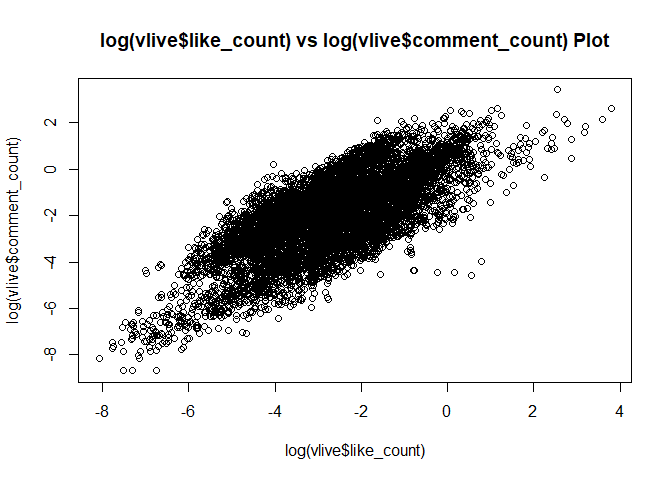
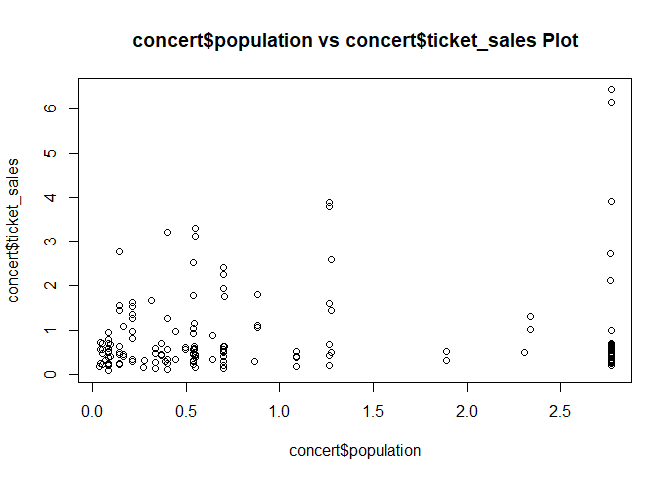

Analyst Internship Test
=======================

이번에 스타트업 analyst internship에 지원하게 되었다. <br /> 사전과제를 받았고, 근 이틀을 온전히 여기에 쏟아부었다. <br /> 그냥 제출하고 끝내기엔 아쉬우니 이렇게 시간 조금만 투자해서 남겨두자. <br />

<style>
p.comment {
background-color: #DBDBDB;
padding: 10px;
border: 1px solid black;
margin-left: 25px;
border-radius: 5px;
}

</style>
문제
----

<p class="comment">
본 스프레드시트는 가상의 공연별 티켓 판매량 데이터입니다. <br /> 1) 아래 설명을 참고하여 'ticket\_sales'를 예측 할 수 있는 'predictive model'을 만들어주세요. <br /> 2) feature engineering 및 modeling 과정을 설명해주세요. 자유로운 방식으로 전달해주시면 됩니다. <br /> 3) 결과물을 송부하실 때는 아래 내용을 반드시 포함해주세요: feature engineering 및 modeling의 전체 코드, 과정 및 평가 방식에 대한 설명 <br /> "주요 식별 데이터는 마스킹되었고, 수치형 데이터의 경우 암호화 되었습니다. 분석에는 영향이 없으므로 별도의 복호없이 사용하시면 됩니다." <br /> <strong>concert\_list</strong> <br /> artist 아티스트 <br /> continent 공연 대륙 <br /> city 공연 도시 <br /> closing\_date "예측 분석 마감일 (해당 공연 예측에 사용되는 데이터는 언제나 마감일 기준 과거의 데이터여야 합니다.) <br /> \* 예) closing\_date = '2019-09-09'일 경우, 2019년 9월 9일 이전의 데이터를 사용하여 예측 분석해야함" <br /> make 공연에 대한 MMT의 make 카운트 <br /> population 공연 해당 국가의 특정 연령층 인구 수 <br /> gdp 공연 해당 국가의 gdp <br /> tastemaker\_count 공연 해당 국가의 '아무 공연'에 make를 누른 사람의 수 <br /> ticket\_sales 공연 티켓 판매량 <br /> <br /> <strong>artist\_list</strong> <br /> artist 아티스트 <br /> gender 아티스트의 성별 ( 0 : 남성, 1 : 여성, 2 : 혼성 ) <br /> <br /> <strong>vlive\_data</strong> 아티스트의 V Live 데이터 <br /> artist 아티스트 <br /> upload\_date 비디오의 업로드 날짜 <br /> follower 아티스트의 V LIVE 팔로워 수 <br /> playtime 비디오의 재생 시간 ( 총 재생된 시간이 아닌, Video 자체의 길이 ) <br /> view\_count 비디오의 총 재생 횟수 <br /> like\_count 비디오의 '좋아요' 개수 <br /> comment\_count 비디오의 댓글 수 <br /> <br /> <strong>mv\_data</strong> 아티스트의 뮤직비디오 데이터 <br /> artist 아티스트 <br /> upload\_date 뮤직비디오의 업로드 날짜 <br /> view\_count 뮤직비디오 재생 횟수 <br /> like\_count 뮤직비디오의 '좋아요' 개수 <br /> dislike\_count 뮤직비디오의 '싫어요' 개수 <br /> comment\_count 뮤직비디오의 댓글 수 <br /> <br /> <strong>twitter\_data</strong> 아티스트의 트위터 데이터 <br /> artist 아티스트 <br /> upload\_date 트윗의 업로드 날짜 <br /> follower 아티스트의 트위터 팔로워 수 <br /> total\_tweet 아티스트가 작성한 총 트윗 개수 <br /> like\_count 해당 트윗의 '좋아요' 개수 <br /> retweet\_count 해당 트윗의 리트윗 수 <br /> comment\_count 해당 트윗의 댓글 수 <br />
</p>
언제까지 링크가 존재할지 모르겠지만, <https://bit.ly/2n69uPE> 으로 데이터를 다운받을 수 있다.

단상
----

이 작업을 하면서, 학교다닐적 과제 생각이 많이 났다. EDA(Exploratory Data Analysis, 탐색적자료분석)수업에서 과제를 받으면, 데이터를 살펴보는데만 시간이 엄청나게 걸린다. 분석 자체는 웬만한 경우에 있어, 코드 몇 줄 걸리지 않는다. 물론, 그 코드 자체를 충분히 잘 알고 있어야 제대로 쓰는 것이지만, 프로그램이 코드를 실행해주기 때문에 코드 몇 줄짜리다.

제일 시간이 많이 걸리는 부분은 데이터 전처리Data Processing와 EDA다.

자기자신과 관련이 없는 이런 데이터들을 주의깊게 살펴볼 사람은 거의 없겠지만, 일단 남겨두자.

Data, Library Import
--------------------

``` r
library(tidyverse)
library(lubridate)
library(neuralnet)

setwd("C:/Users/Phil2/Downloads")
concert <- read_csv("data_concert.csv")[-10]
artist <- read_csv("data_artist.csv")
vlive <- read_csv("data_vlive.csv")
mv <- read_csv("data_mv.csv")
twitter <- read_csv("data_twitter.csv")
concert
```

    ## # A tibble: 155 x 9
    ##    artist continent city  closing_date  make population   gdp
    ##    <chr>      <dbl> <chr> <chr>        <dbl>      <dbl> <dbl>
    ##  1 aaaa3~         1 76f3~ 2015.11.5    1.17      0.144  2.31 
    ##  2 aaaa3~         1 8d00~ 2015.11.5    1.02      0.0445 2.19 
    ##  3 aaaa3~         1 4cba~ 2015.11.5    1.10      0.0865 1.01 
    ##  4 aaaa3~         1 4d34~ 2015.11.5    1.59      0.0850 0.679
    ##  5 6db3d~         2 cf2c~ 2015.11.22   1.25      0.0524 2.85 
    ##  6 aaaa3~         1 6504~ 2015.11.18   1.17      0.545  1.90 
    ##  7 bdce4~         2 f485~ 2015.12.9    0.808     0.279  0.468
    ##  8 bdce4~         2 daf6~ 2015.12.9    0.772     2.31   0.185
    ##  9 bdce4~         2 5e86~ 2015.12.9    0.539     0.639  0.320
    ## 10 145a1~         1 ccb9~ 2016.3.13    1.14      0.538  1.91 
    ## # ... with 145 more rows, and 2 more variables: tastemaker_count <dbl>,
    ## #   ticket_sales <dbl>

``` r
artist
```

    ## # A tibble: 22 x 2
    ##    artist   gender
    ##    <chr>     <dbl>
    ##  1 aaaa33d9      0
    ##  2 6db3de5a      0
    ##  3 bdce474a      0
    ##  4 145a1215      0
    ##  5 550d7ae2      0
    ##  6 62a22f5c      2
    ##  7 8f4a1945      1
    ##  8 69821cdd      1
    ##  9 9813d312      0
    ## 10 f6450680      1
    ## # ... with 12 more rows

``` r
vlive
```

    ## # A tibble: 8,223 x 7
    ##    artist upload_date follower playtime view_count like_count comment_count
    ##    <chr>  <chr>          <dbl>    <dbl>      <dbl>      <dbl>         <dbl>
    ##  1 bdce4~ 2017.4.2      0.923    0.161      0.171      0.0754       0.0351 
    ##  2 62a22~ 2017.2.11     0.422    0.0764     0.101      0.0169       0.0176 
    ##  3 f6450~ 2016.4.25     0.0861   2.75       0.108      0.0150       0.120  
    ##  4 f6450~ 2017.12.7     0.0861   0.0726     0.0367     0.0103       0.0141 
    ##  5 368e6~ 2017.8.20     0.156    1.23       0.405      0.208        0.188  
    ##  6 368e6~ 2018.5.25     0.156    1.39       0.654      0.312        0.886  
    ##  7 8f4a1~ 2015.6.22     0.143    1.10       0.316      0.0354       0.414  
    ##  8 8f4a1~ 2017.6.7      0.143    2.62       0.0661     0.0426       0.129  
    ##  9 69821~ 2016.1.15     1.28     0.655      0.353      0.0290       0.291  
    ## 10 69821~ 2017.11.16    1.28     0.0634     0.167      0.0227       0.00773
    ## # ... with 8,213 more rows

``` r
mv
```

    ## # A tibble: 203 x 6
    ##    artist   upload_date view_count like_count dislike_count comment_count
    ##    <chr>    <chr>            <dbl>      <dbl>         <dbl>         <dbl>
    ##  1 145a1215 2017.12.20       0.964      1.70          0.838         1.64 
    ##  2 145a1215 2017.8.23        1.40       2.15          1.14          1.88 
    ##  3 786d89ee 2018.4.20        1.08       2.42          2.11          1.96 
    ##  4 f4055a26 2018.3.21        1.44       3.50          1.81          5.02 
    ##  5 145a1215 2017.1.25        0.816      1.62          0.558         1.38 
    ##  6 786d89ee 2018.1.23        1.90       3.77          2.42          3.69 
    ##  7 f4055a26 2017.10.4        1.17       2.49          0.774         2.37 
    ##  8 a9fba206 2017.10.11       0.263      0.834         0.142         0.531
    ##  9 145a1215 2016.9.8         1.25       2.29          0.976         1.26 
    ## 10 786d89ee 2017.8.23        0.982      1.79          0.750         1.41 
    ## # ... with 193 more rows

``` r
twitter
```

    ## # A tibble: 20,001 x 7
    ##    artist upload_date follower total_tweet like_count retweet_count
    ##    <chr>  <chr>          <dbl>       <dbl>      <dbl>         <dbl>
    ##  1 145a1~ 2018.6.17       1.68        2.05      3.91          2.89 
    ##  2 145a1~ 2018.6.16       1.68        2.05      4.71          3.70 
    ##  3 145a1~ 2018.6.14       1.68        2.05      3.74          3.17 
    ##  4 145a1~ 2018.6.19       1.68        2.05      3.96          2.85 
    ##  5 145a1~ 2018.6.16       1.68        2.05      3.99          3.17 
    ##  6 145a1~ 2018.6.21       1.68        2.05      0.686         0.320
    ##  7 145a1~ 2018.6.21       1.68        2.05      0.775         0.358
    ##  8 145a1~ 2018.6.20       1.68        2.05      0.814         0.361
    ##  9 145a1~ 2018.6.19       1.68        2.05      1.89          1.39 
    ## 10 145a1~ 2018.6.17       1.68        2.05      3.42          2.57 
    ## # ... with 19,991 more rows, and 1 more variable: comment_count <dbl>

그런데 작업을 하다보니, 꽤나 중대한 오류를 발견했다. <br /> `concert` 테이블의 `closing_date()`를 항상 염두에 두어야 하는데, 날짜에서 2016.6.4 &lt; 2016.9.6은 참이지만, 2016.6.4 &lt; 2016.10.8은 거짓이다. 06.04 &lt; 10.08는 참으로 인식을 하니, 날짜 부분에 수정이 필요하다.

``` r
concert <- concert %>% 
  mutate(closing_date = ymd(closing_date))
```

    ## Warning: The `printer` argument is deprecated as of rlang 0.3.0.
    ## This warning is displayed once per session.

``` r
vlive <- vlive %>% 
  mutate(upload_date = ymd(upload_date))
mv <- mv %>% 
  mutate(upload_date = ymd(upload_date))
twitter <- twitter %>% 
  mutate(upload_date = ymd(upload_date))
```

### Basic Info

`artist`에서 볼 수 있듯이, 총 아티스트는 22명이다.

``` r
name <- unique(concert$artist)
name
```

    ##  [1] "aaaa33d9" "6db3de5a" "bdce474a" "145a1215" "550d7ae2" "62a22f5c"
    ##  [7] "8f4a1945" "69821cdd" "9813d312" "f6450680" "9a97f004" "f4055a26"
    ## [13] "a9fba206" "df2f46fe" "eb5df12f" "04f847a8" "3177b023" "786d89ee"
    ## [19] "4535115f" "368e6703" "e6d5dbf2" "b9a0f75b"

``` r
length(name)
```

    ## [1] 22

`closing_date()`는 총 몇개일까?

``` r
dates <- unique(concert$closing_date)
dates
```

    ##  [1] "2015-11-05" "2015-11-22" "2015-11-18" "2015-12-09" "2016-03-13"
    ##  [6] "2016-02-06" "2016-03-11" "2016-04-09" "2016-04-21" "2016-05-12"
    ## [11] "2016-03-09" "2016-03-25" "2016-09-01" "2016-09-09" "2016-08-24"
    ## [16] "2016-10-08" "2016-12-29" "2016-11-25" "2016-12-03" "2016-12-04"
    ## [21] "2017-03-03" "2017-03-10" "2017-01-27" "2017-02-23" "2017-04-06"
    ## [26] "2017-02-09" "2017-03-18" "2017-06-21" "2017-06-04" "2017-06-22"
    ## [31] "2017-06-25" "2017-07-10" "2017-07-07" "2017-10-06" "2017-10-15"
    ## [36] "2017-09-16" "2017-10-21" "2017-10-08" "2017-10-11" "2017-10-18"
    ## [41] "2017-11-29" "2017-11-22" "2018-01-25" "2018-02-11" "2018-02-25"
    ## [46] "2018-03-30" "2017-12-14" "2018-04-28" "2018-04-27"

``` r
length(dates)
```

    ## [1] 49

총 49개인 것을 확인할 수 있다.

자, 그럼 특정 아티스트가 특정 날짜에 콘서트를 열었다면? <br /> 그 날짜까지의 `mv`, `vlive`, `twitter`의 자료를 어떻게 종합할 수 있을까?

``` r
vlive %>% 
  filter(artist == name[1]) %>% 
  filter(upload_date <= dates[4])
```

    ## # A tibble: 74 x 7
    ##    artist upload_date follower playtime view_count like_count comment_count
    ##    <chr>  <date>         <dbl>    <dbl>      <dbl>      <dbl>         <dbl>
    ##  1 aaaa3~ 2014-08-30     0.659   0.0183      0.463     0.0127        0.0471
    ##  2 aaaa3~ 2015-08-08     0.659   0.303       0.441     0.0495        0.351 
    ##  3 aaaa3~ 2015-02-11     0.659   0.0504      0.387     0.0140        0.0298
    ##  4 aaaa3~ 2015-10-09     0.659   0.115       0.245     0.0136        0.0402
    ##  5 aaaa3~ 2014-08-20     0.659   0.0703      0.548     0.0192        0.0623
    ##  6 aaaa3~ 2015-02-11     0.659   2.01        0.859     0.266         2.66  
    ##  7 aaaa3~ 2015-08-06     0.659   0.335       0.373     0.0264        0.177 
    ##  8 aaaa3~ 2015-05-01     0.659   2.42        0.612     0.0958        1.25  
    ##  9 aaaa3~ 2015-05-01     0.659   2.20        0.629     0.108         1.10  
    ## 10 aaaa3~ 2015-04-27     0.659   1.32        0.651     0.0499        0.261 
    ## # ... with 64 more rows

``` r
# mv %>% 
#   filter(artist == name[1]) %>% 
#   filter(upload_date <= dates[4])
# twitter %>%
#   filter(artist == name[1]) %>%
#   filter(upload_date <= dates[4])
```

이런 식으로, filter를 만들 수 있다.

``` r
what_filter <- function(what, name, date) {
  what %>% 
    filter(artist == name) %>% 
    filter(upload_date <= date)
}
what_filter(vlive, name[1], dates[4])
```

    ## # A tibble: 74 x 7
    ##    artist upload_date follower playtime view_count like_count comment_count
    ##    <chr>  <date>         <dbl>    <dbl>      <dbl>      <dbl>         <dbl>
    ##  1 aaaa3~ 2014-08-30     0.659   0.0183      0.463     0.0127        0.0471
    ##  2 aaaa3~ 2015-08-08     0.659   0.303       0.441     0.0495        0.351 
    ##  3 aaaa3~ 2015-02-11     0.659   0.0504      0.387     0.0140        0.0298
    ##  4 aaaa3~ 2015-10-09     0.659   0.115       0.245     0.0136        0.0402
    ##  5 aaaa3~ 2014-08-20     0.659   0.0703      0.548     0.0192        0.0623
    ##  6 aaaa3~ 2015-02-11     0.659   2.01        0.859     0.266         2.66  
    ##  7 aaaa3~ 2015-08-06     0.659   0.335       0.373     0.0264        0.177 
    ##  8 aaaa3~ 2015-05-01     0.659   2.42        0.612     0.0958        1.25  
    ##  9 aaaa3~ 2015-05-01     0.659   2.20        0.629     0.108         1.10  
    ## 10 aaaa3~ 2015-04-27     0.659   1.32        0.651     0.0499        0.261 
    ## # ... with 64 more rows

EDA
---

### Twitter

먼저, 데이터의 분포를 알아보자.

``` r
par(mfrow = c(2, 2))
boxplot(twitter$comment_count, main = "twitter$comment_count Boxplot") 
boxplot(twitter$retweet_count, main = "twitter$retweet_count Boxplot")
boxplot(twitter$like_count, main = "twitter$like_count Boxplot")
```

 boxplot을 보면 알 수 있듯이, 비대칭이 심하고, outlier값들이 많은 것을 보아, 로그 변환이 필요한 것을 볼 수 있다.

``` r
par(mfrow = c(2, 2))
boxplot(log(twitter$comment_count), main = "log(twitter$comment_count) Boxplot")
```

    ## Warning in bplt(at[i], wid = width[i], stats = z$stats[, i], out =
    ## z$out[z$group == : Outlier (-Inf) in boxplot 1 is not drawn

``` r
boxplot(log(twitter$retweet_count), main = "log(twitter$retweet_count) Boxplot")
boxplot(log(twitter$like_count), main = "log(twitter$like_count) Boxplot")
```

 이렇게 로그변환을 하고 나면, 대칭화가 잘 된 것을 확인할 수 있음

그런데 하다보면 이러한 의문이 든다. <br /> reteweet이 많으면 comment도 많고, comment가 많으면 like도 많고, retweet이 많으면 like도 많지 않을까? <br /> plot을 그려보면 된다.

``` r
par(mfrow = c(1, 1))
plot(log(twitter$retweet_count), log(twitter$comment_count),
     main = "log(twitter$retweet_count) vs log(twitter$comment_count)") # retweet과 comment간의 높은 상관성
```


``` r
plot(log(twitter$comment_count), log(twitter$like_count),
     main = "log(twitter$comment_count) vs log(twitter$like_count)") # comment와 like간의 높은 상관성
```


``` r
plot(log(twitter$retweet_count), log(twitter$like_count),
     main = "log(twitter$retweet_count) vs log(twitter$like_count)") # retweet과 like간의 매우 높은 상관성을 볼 수 있다.
```


Retweet과 comment간의 높은 상관성, Comment와 like간의 높은 상관성, retweet과 like간의 높은 상관성을 볼 수 있다. <br /> 그래서 결론적으로, 이 twitter 자료에서 셋 중에 하나만 반영해줘도 될 것 같다.

또한 몇 가지 문제점을 발견했다. <br /> 먼저, twitter의 follower 수가 거의 변하지 않는 걸 볼 수 있다.

``` r
artist_follower <- list()
for(i in 1:length(name)){
  artist_follower[[i]] <- twitter %>% 
    filter(artist == name[i]) %>% 
    select(follower) %>% 
    unique %>% 
    pull
}
artist_follower
```

    ## [[1]]
    ## [1] 0.2557210 0.2556742 0.2557124
    ## 
    ## [[2]]
    ## [1] 0.8578787 0.8578071 0.8581243 0.8582100 0.8583576 0.8583781 0.8583953
    ## 
    ## [[3]]
    ## [1] 0.5904171 0.5903105 0.5903940
    ## 
    ## [[4]]
    ## [1] 1.684307 1.684329 1.684080 1.684819
    ## 
    ## [[5]]
    ## [1] 2.305873 2.305897 2.305725 2.306673
    ## 
    ## [[6]]
    ## [1] 0.2160286 0.2159709 0.2160436 0.2160474
    ## 
    ## [[7]]
    ## [1] 0.07870735 0.07868149 0.07872620 0.07872997 0.07873051
    ## 
    ## [[8]]
    ## [1] 0.4437470 0.4436361 0.4437292 0.4437503 0.4437551
    ## 
    ## [[9]]
    ## [1] 0.03611043 0.03609965 0.03611473
    ## 
    ## [[10]]
    ## [1] 0.07034525 0.07037111 0.07042120
    ## 
    ## [[11]]
    ## [1] 0.06867380 0.06871905 0.06880092 0.06883270 0.06883378 0.06883863
    ## 
    ## [[12]]
    ## [1] 3.636284 3.636323 3.635225 3.637575
    ## 
    ## [[13]]
    ## [1] 0.5916965 0.5916873 0.5912779 0.5919776
    ## 
    ## [[14]]
    ## [1] 0.5011397 0.5011026 0.5013170
    ## 
    ## [[15]]
    ## [1] 0.7683864 0.7682356 0.7684144 0.7684403
    ## 
    ## [[16]]
    ## [1] 0.1005111 0.1005353 0.1006274
    ## 
    ## [[17]]
    ## [1] 0.00611752 0.00611536 0.00611967
    ## 
    ## [[18]]
    ## [1] 0.7860220 0.7860543
    ## 
    ## [[19]]
    ## [1] 0.08685129 0.08682166 0.08689007
    ## 
    ## [[20]]
    ## [1] 0.2199920 0.2200232 0.2200545 0.2200690
    ## 
    ## [[21]]
    ## [1] 0.2148322 0.2148958 0.2149054 0.2149119 0.2149636 0.2149669 0.2151446
    ## 
    ## [[22]]
    ## [1] 0.01050433 0.01050002 0.01050864

이걸 보면, 리스트 안의 숫자가 거의 변하지 않는 걸 볼 수 있다. <br /> 즉, dates별로 총 follwer 수는 증가하거나 감소해야하는데, 그렇지 않다는 것이다.

마찬가지로, total\_tweet, 총 트윗 수도 dates별로 변하질 않는다.

``` r
artist_total_tweet <- list()
for(i in 1:length(name)){
  artist_total_tweet[[i]] <- twitter %>% 
    filter(artist == name[i]) %>% 
    select(total_tweet) %>% 
    unique %>% 
    pull
}
artist_total_tweet
```

    ## [[1]]
    ## [1] 0.9944868
    ## 
    ## [[2]]
    ## [1] 1.780825
    ## 
    ## [[3]]
    ## [1] 4.069742 4.070219
    ## 
    ## [[4]]
    ## [1] 2.051442 2.052396
    ## 
    ## [[5]]
    ## [1] 3.119842 3.120080 3.121034
    ## 
    ## [[6]]
    ## [1] 0.3566896
    ## 
    ## [[7]]
    ## [1] 1.253659 1.253897 1.254136
    ## 
    ## [[8]]
    ## [1] 1.497572 1.499241 1.499956 1.501387 1.504963
    ## 
    ## [[9]]
    ## [1] 0.8082738 0.8085123
    ## 
    ## [[10]]
    ## [1] 0.7350762 0.7357915
    ## 
    ## [[11]]
    ## [1] 0.06556794 0.06580637
    ## 
    ## [[12]]
    ## [1] 2.255775 2.256491
    ## 
    ## [[13]]
    ## [1] 0.6141927
    ## 
    ## [[14]]
    ## [1] 1.129199 1.133014 1.133491
    ## 
    ## [[15]]
    ## [1] 1.729325 1.729563 1.729801
    ## 
    ## [[16]]
    ## [1] 0.9890029 0.9894798
    ## 
    ## [[17]]
    ## [1] 0.1082467 0.1084851
    ## 
    ## [[18]]
    ## [1] 1.020476
    ## 
    ## [[19]]
    ## [1] 1.740769 1.741008 1.741484
    ## 
    ## [[20]]
    ## [1] 0.6935896
    ## 
    ## [[21]]
    ## [1] 0.7772781 0.7777549 0.7779934 0.7784702
    ## 
    ## [[22]]
    ## [1] 0.0660448

여기서도 리스트 안의 숫자가 거의 변하지 않는다. <br /> 즉, dates별로 총 트윗 수가 증가해야하는데, 그렇지 않다는 것이다.

사실 이 twitter 자료를 공신력 있는 자료를 통해 수치화시켜서 반영해보려 구글 검색을 해보았다. <br /> Twitter impact라는 것이 있고, [https://arxiv.org/ftp/arxiv/papers/1404/1404.5239.pdf를](https://arxiv.org/ftp/arxiv/papers/1404/1404.5239.pdf를) 참고해서, retweet과 follower를 적절히 반영한 객관적인 값을 도출해보려 했는데, <br /> follwer의 수와 total\_tweet수에 거의 차이가 없는 에러가 있고, 수치가 암호화되어 retweet이 1 미만인 등 여러가지 문제가 있어 대입이 불가능했다.

### mv

뮤직 비디오의 경우에는, twitter와 같은 impact를 수치화시키는 논문을 찾지 못했다. <br /> 맨 처음에는 생각해보았을 때, view x (like - dislike) x comment라고 생각했는데, 앞으로 알아보면, view가 많으면 comment도 많은 걸 볼 수 있다. <br /> 그래서 최종적으로는 view x (like - dislike)만 포함하기로 결론내렸다.

이것도 데이터의 분포를 먼저 살펴보자.

``` r
par(mfrow = c(2, 2))
boxplot(mv$view_count, main = "mv$view_count Boxplot")
boxplot(mv$like_count, main = "mv$like_count Boxplot")
boxplot(mv$dislike_count, main = "mv$dislike_count Boxplot")
boxplot(mv$comment_count, main = "mv$comment_count Boxplot")
```

 boxplot을 보면, twitter때와 마찬가지로 로그 변환이 필요한 것을 볼 수 있다.

``` r
par(mfrow = c(2, 2))
boxplot(log(mv$view_count), main = "log(mv$view_count) Boxplot")
boxplot(log(mv$like_count), main = "log(mv$like_count) Boxplot")
boxplot(log(mv$dislike_count), main = "log(mv$dislike_count) Boxplot")
boxplot(log(mv$comment_count), main = "log(mv$comment_count) Boxplot")
```

 대칭화가 잘 된 것을 볼 수 있다.

뮤직비디오의 경우에는 like와 dislike는 반비례 관계가 아닐까? <br /> 즉, like가 많으면 dislike가 적고, like가 적으면 dislike가 많지 않을까?

``` r
plot(log(mv$like_count), log(mv$dislike_count), main = "log(mv$like_count) vs log(mv$dislike_count) Plot")
```

 그렇지 않은 것을 볼 수 있다. 둘은 정비례 관계다. <br /> 좋아하는 사람이 많으면 싫어하는 사람도 많다.

나머지는 우리가 생각한 것과 마찬가지다. <br /> view가 많으면, like도 많고, <br /> view가 많으면, dislike도 많으며, <br /> view가 많으면, comment도 많다. <br /> comment가 많으면, like도 많고, <br /> comment가 많으면, dislike도 많다.

``` r
par(mfrow = c(1, 1))
plot(log(mv$view_count), log(mv$like_count), 
     main = "log(mv$view_count) vs log(mv$like_count) Plot") # view가 많으면, like도 많음
```


``` r
plot(log(mv$view_count), log(mv$dislike_count), 
     main = "log(mv$view_count) vs log(mv$dislike_count) Plot") # view가 많으면, dislike도 많음
```


``` r
plot(log(mv$comment_count), log(mv$like_count), 
     main = "log(mv$comment_count) vs log(mv$like_count) Plot") # comment가 많으면, like도 많고
```


``` r
plot(log(mv$comment_count), log(mv$dislike_count), 
     main = "log(mv$comment_count) vs log(mv$dislike_count) Plot") # comment가 많으면, dislike도 많음
```


``` r
plot(log(mv$view_count), log(mv$comment_count), 
     main = "log(mv$view_count) vs log(mv$comment_count) Plot") # view가 많으면, comment도 많음
```


EDA를 이렇게 하다보면, 여러가지 아이디어들이 떠오른다. <br /> 뮤직비디오가 히트를 치고나면, ticket\_sales가 확 늘지는 않을까? <br /> 히트곡이라는게 중요하니깐. <br /> 예를 찾아보자.

``` r
mv %>% 
  filter(artist == name[4]) %>%
  arrange(desc(view_count))
```

    ## # A tibble: 10 x 6
    ##    artist   upload_date view_count like_count dislike_count comment_count
    ##    <chr>    <date>           <dbl>      <dbl>         <dbl>         <dbl>
    ##  1 145a1215 2016-01-21       1.44       2.06          0.799         1.25 
    ##  2 145a1215 2017-08-23       1.40       2.15          1.14          1.88 
    ##  3 145a1215 2016-09-08       1.25       2.29          0.976         1.26 
    ##  4 145a1215 2017-12-20       0.964      1.70          0.838         1.64 
    ##  5 145a1215 2017-01-25       0.816      1.62          0.558         1.38 
    ##  6 145a1215 2015-03-19       0.708      1.22          0.406         0.709
    ##  7 145a1215 2014-03-15       0.675      0.822         0.427         0.261
    ##  8 145a1215 2016-04-20       0.623      1.43          0.452         0.889
    ##  9 145a1215 2014-07-09       0.603      0.695         0.341         0.245
    ## 10 145a1215 2015-08-05       0.355      0.788         0.225         0.594

name\[4\]는 2016-09-08에 내놓은 뮤직비디오가 히트를 쳤다. 그럼 그 이후로 ticket sales가 늘어났을까?

``` r
concert %>% 
  filter(artist == name[4]) %>% 
  filter(closing_date < "2016-09-08") %>% 
  select(artist, closing_date, make, ticket_sales)
```

    ## # A tibble: 3 x 4
    ##   artist   closing_date  make ticket_sales
    ##   <chr>    <date>       <dbl>        <dbl>
    ## 1 145a1215 2016-03-13   1.14          1.78
    ## 2 145a1215 2016-03-13   1.08          2.25
    ## 3 145a1215 2016-03-13   0.285         2.60

``` r
concert %>% 
  filter(artist == name[4]) %>% 
  filter(closing_date >= "2016-09-08") %>% 
  select(artist, closing_date, make, ticket_sales)
```

    ## # A tibble: 3 x 4
    ##   artist   closing_date  make ticket_sales
    ##   <chr>    <date>       <dbl>        <dbl>
    ## 1 145a1215 2016-12-03    2.23         3.11
    ## 2 145a1215 2016-12-03    1.62         2.78
    ## 3 145a1215 2016-12-03    3.11         3.20

실제로 꽤늘어난 것을 확인할 수 있다.

하지만 꼭 그런 것은 아니다.

``` r
mv %>% 
  filter(artist == name[13]) %>%
  arrange(desc(view_count))
```

    ## # A tibble: 16 x 6
    ##    artist   upload_date view_count like_count dislike_count comment_count
    ##    <chr>    <date>           <dbl>      <dbl>         <dbl>         <dbl>
    ##  1 a9fba206 2017-04-27       0.910      1.82          0.529         1.07 
    ##  2 a9fba206 2014-07-08       0.802      1.22          0.354         0.591
    ##  3 a9fba206 2015-11-07       0.712      1.28          0.308         0.605
    ##  4 a9fba206 2015-12-08       0.606      0.935         0.265         0.366
    ##  5 a9fba206 2015-01-29       0.477      0.776         0.171         0.386
    ##  6 a9fba206 2016-07-08       0.463      0.898         0.214         0.321
    ##  7 a9fba206 2016-01-06       0.390      0.808         0.200         0.322
    ##  8 a9fba206 2016-04-08       0.320      0.703         0.173         0.304
    ##  9 a9fba206 2016-02-06       0.303      0.667         0.177         0.289
    ## 10 a9fba206 2017-10-11       0.263      0.834         0.142         0.531
    ## 11 a9fba206 2016-06-08       0.256      0.632         0.132         0.307
    ## 12 a9fba206 2016-07-31       0.248      0.627         0.142         0.258
    ## 13 a9fba206 2016-10-07       0.227      0.628         0.119         0.280
    ## 14 a9fba206 2016-03-09       0.225      0.613         0.134         0.254
    ## 15 a9fba206 2016-05-07       0.202      0.599         0.142         0.305
    ## 16 a9fba206 2018-05-16       0.161      1.13          0.193         0.736

name\[13\]은 2017-04-27에 내놓은 뮤직비디오가 나름 히트를 쳤다. 그럼 그 이후의 ticket sales는?

``` r
concert %>% 
  filter(artist == name[13]) %>% 
  filter(closing_date < "2017-04-27") %>% 
  select(artist, closing_date, make, ticket_sales)
```

    ## # A tibble: 3 x 4
    ##   artist   closing_date  make ticket_sales
    ##   <chr>    <date>       <dbl>        <dbl>
    ## 1 a9fba206 2017-01-27   0.368         1.25
    ## 2 a9fba206 2017-01-27   0.338         1.36
    ## 3 a9fba206 2017-03-18   1.07          1.80

``` r
concert %>% 
  filter(artist == name[13]) %>% 
  filter(closing_date >= "2017-04-27") %>% 
  select(artist, closing_date, make, ticket_sales)
```

    ## # A tibble: 4 x 4
    ##   artist   closing_date  make ticket_sales
    ##   <chr>    <date>       <dbl>        <dbl>
    ## 1 a9fba206 2017-07-07    4.57         1.61
    ## 2 a9fba206 2017-07-07    3.41         1.26
    ## 3 a9fba206 2017-07-07    3.23         1.94
    ## 4 a9fba206 2017-07-07    1.53         1.56

그 이후로 make는 확실하게 많이 늘어난 것을 볼 수 있는데, ticket sales는 별로 늘지 않았다.

근데 make가 늘어봐야 ticket sales는 별로 늘지 않았다. 이건 좀 주의 깊게 볼 부분인 것 같다.

### vlive

이제 vlive로 넘어가보자. <br /> vlive의 경우에도, twitter 자료처럼 follower수가 변하지 않는 에러가 있다. <br /> mv가 히트를 친 전후로, follower 수가 어떻게 변하는지를 보고 싶었는데 불가능했다.

``` r
vlive_follower <- list()
for(i in 1:length(name)){
  vlive_follower[[i]] <- vlive %>% 
    filter(artist == name[i]) %>% 
    select(follower) %>% 
    unique %>% 
    pull
}
vlive_follower
```

    ## [[1]]
    ## [1] 0.6590945
    ## 
    ## [[2]]
    ## [1] 0.9592239 0.9592233
    ## 
    ## [[3]]
    ## [1] 0.9234259
    ## 
    ## [[4]]
    ## [1] 1.567623 1.567620
    ## 
    ## [[5]]
    ## [1] 2.114474 2.114475 2.114472
    ## 
    ## [[6]]
    ## [1] 0.4219141 0.4219068
    ## 
    ## [[7]]
    ## [1] 0.142937
    ## 
    ## [[8]]
    ## [1] 1.283467
    ## 
    ## [[9]]
    ## [1] 0.4277924 0.4277930
    ## 
    ## [[10]]
    ## [1] 0.08609141 0.08608974 0.08609085
    ## 
    ## [[11]]
    ## [1] 0.06737213 0.06737770
    ## 
    ## [[12]]
    ## [1] 3.548083 3.548075
    ## 
    ## [[13]]
    ## [1] 0.4653039 0.4653167 0.4653173
    ## 
    ## [[14]]
    ## [1] 0.8107003 0.8106992
    ## 
    ## [[15]]
    ## [1] 1.246296 1.246295
    ## 
    ## [[16]]
    ## [1] 0.07140891 0.07141336 0.07141280
    ## 
    ## [[17]]
    ## [1] 0.01126888 0.01126999
    ## 
    ## [[18]]
    ## [1] 0.8414419 0.8414375
    ## 
    ## [[19]]
    ## [1] 0.1735160 0.1735171
    ## 
    ## [[20]]
    ## [1] 0.1562596 0.1562418
    ## 
    ## [[21]]
    ## [1] 0.2720947 0.2720941
    ## 
    ## [[22]]
    ## [1] 0.01789789 0.01789845

리스트 안의 숫자가 거의 변하지 않는 것으로 보아, 에러가 있음을 알 수 있다.

그렇다면 follower 말고, view\_count라도 늘지 않았을까? <br /> 결론을 내자면 전혀 영향이 없었다.

``` r
before1 <- vlive %>% 
  filter(artist == name[4]) %>% 
  filter(upload_date < "2016-09-08") %>% 
  arrange(desc(upload_date)) %>% 
  select(view_count)

after1 <- vlive %>% 
  filter(artist == name[4]) %>% 
  filter(upload_date >= "2016-09-08") %>% 
  arrange(upload_date) %>% 
  select(view_count)

par(mfrow = c(1, 2))
boxplot(before1, ylim = c(0, 4), main = "Before hit 2016-09-08 Boxplot")
boxplot(after1, ylim = c(0, 4), main = "After hit 2016-09-08 Boxplot")
```

 앞서 해봤던, name\[4\]의 2016-09-08의 히트작 전후의 boxplot을 그려본 것이다. <br /> 딱히 차이가 없는 것을 볼 수 있다.

name\[13\]의 2017-04-27의 히트작의 경우에는?

``` r
before2 <- vlive %>% 
  filter(artist == name[13]) %>% 
  filter(upload_date < "2017-04-27") %>% 
  arrange(desc(upload_date)) %>% 
  select(view_count)

after2 <- vlive %>% 
  filter(artist == name[13]) %>% 
  arrange(upload_date) %>% 
  select(view_count)

par(mfrow = c(1, 2))
boxplot(before2, ylim = c(0, 1), main = "Before hit 2017-04-27 Boxplot")
boxplot(after2, ylim = c(0, 1), main = "After hit 2017-04-27 Boxplot")
```


이 경우에도 별로 늘었다고 할 수가 없다. <br /> 뮤직 비디오가 히트를 치고 나면, 인기를 얻어서 그 이후에 vlive도 더 많이 볼 것이다...하는 그런 가정은 안 통하는 것이다.

자 이제 데이터를 살펴보자.

``` r
boxplot(vlive$view_count, main = "vlive$view_count Boxplot")
```


``` r
boxplot(vlive$like_count, main = "vlive$like_count Boxplot")
```


``` r
boxplot(vlive$comment_count, main = "vlive$comment_count Boxplot")
```

 이전 자료들과 마찬가지로 극심한 비대칭을 볼 수 있다. 로그 변환을 해주자.

``` r
boxplot(log(vlive$view_count), main = "log(vlive$view_count) Boxplot")
```


``` r
boxplot(log(vlive$like_count), main = "log(vlive$like_count) Boxplot")
```


``` r
boxplot(log(vlive$comment_count), main = "log(vlive$comment_count) Boxplot")
```

 대칭화가 잘 되었다.

vlive도 마찬가지로 view가 많으면 like가 많고, <br /> view가 많으면 count도 많고, <br /> like가 많으면 comment도 많지 않을까? <br /> 당연히 그렇다.

``` r
par(mfrow = c(1, 1))
plot(log(vlive$view_count), log(vlive$like_count), 
     main = "log(vlive$view_count) vs log(vlive$like_count) Plot") # view가 많으면 like도 많음. 높은 상관성
```


``` r
plot(log(vlive$view_count), log(vlive$comment_count), 
     main = "log(vlive$view_count) vs log(vlive$comment_count) Plot") # view가 많으면 comment도 많음.
```


``` r
plot(log(vlive$like_count), log(vlive$comment_count), 
     main = "log(vlive$like_count) vs log(vlive$comment_count) Plot") # like가 많으면 comment도 많음.
```



그런데 playtime의 경우에는? <br /> playtime이 길어질수록 view도 늘어나고, like도 늘어나고, comment도 늘어나는 그런건 없을까?

``` r
plot(log(vlive$playtime), log(vlive$view_count),
     main = "log(vlive$playtime) vs log(vlive$view_count) Plot")
```


``` r
plot(log(vlive$playtime), log(vlive$like_count),
     main = "log(vlive$playtime) vs log(vlive$like_count) Plot")
```


``` r
plot(log(vlive$playtime), log(vlive$comment_count),
     main = "log(vlive$playtime) vs log(vlive$comment_count) Plot")
```

 없다. 처음에는 playtime이 길어지면 그만큼 보는 사람도 늘어나고, like도 늘어나고, 그만큼 comment도 늘어날거라 생각했는데, 아니었다.

그래서 결론적으로 vlive의 경우에는 많이 참고할 것 없이 최근 upload된 것의 view\_count 정도만 참고하자.

### overall

이것도 EDA의 부산물인데, 전반적으로 살펴보았을 때의 이것저것들에 대해 알아본 것이다. <br /> name\[9\]는 꽤 활동기간이 오래된 가수 <br /> name\[12\]는 빅네임. ticket sales도 항상 많음. <br /> name\[13\]은 2017.4.27의 히트 이후 make는 확 늘었지만 ticket sales는 확 늘지 않음 <br /> name\[14\]는 2017.3.1, 2017.11.15의 히트 이후 make는 확 늘었지만 ticket sales는 뭐 비슷 <br /> name\[16\], name\[19\]은 히트작도 없고 ticket sales도 비슷비슷. 근데 얘는 비슷한 날, 같은 국가의 여러 도시에 공연을 돌았음. <br /> name\[18\]은 2018.1.23의 히트 이후에 ticket sales가 많이 많이 늘었음. 1.5 배 이상 <br /> 전반적으로, name\[4\], name\[5\], name\[12\], name\[18\]가 빅네임

그리고 make와 ticket sales는 별로 상관이 없어 보인다.

### concert

gdp와 ticket sales는 별로 연관이 없다. 어짜피 볼 애들은 정해져있고, 그들만 본다. <br /> population도 마찬가지, make도 마찬가지.

``` r
plot(concert$gdp, concert$ticket_sales, main = "concert$gdp vs concert$ticket_sales Plot")
```


``` r
plot(concert$population, concert$ticket_sales, main = "concert$population vs concert$ticket_sales Plot")
```



``` r
plot(concert$make, concert$ticket_sales, main = "concert$make vs concert$ticket_sales Plot")
```


make가 많으면 근처에 친구들도 많아서 tastemaker도 많을 것 같다.

``` r
plot(concert$make, concert$tastemaker_count, main = "concert$make vs concert$tastemaker_count Plot")
```

 그렇지 않다.

자 지루하고 길고 긴 EDA가 끝났다. 그럼 이제 Feature engineering으로 넘어가보자. <br /> 이 때까지 EDA에서 얻은 결론들을 어떻게 반영하는게 좋을까?

Feature Engineering
-------------------
