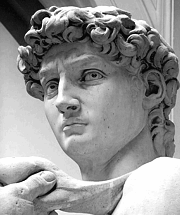
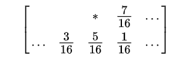
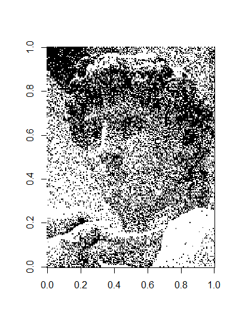
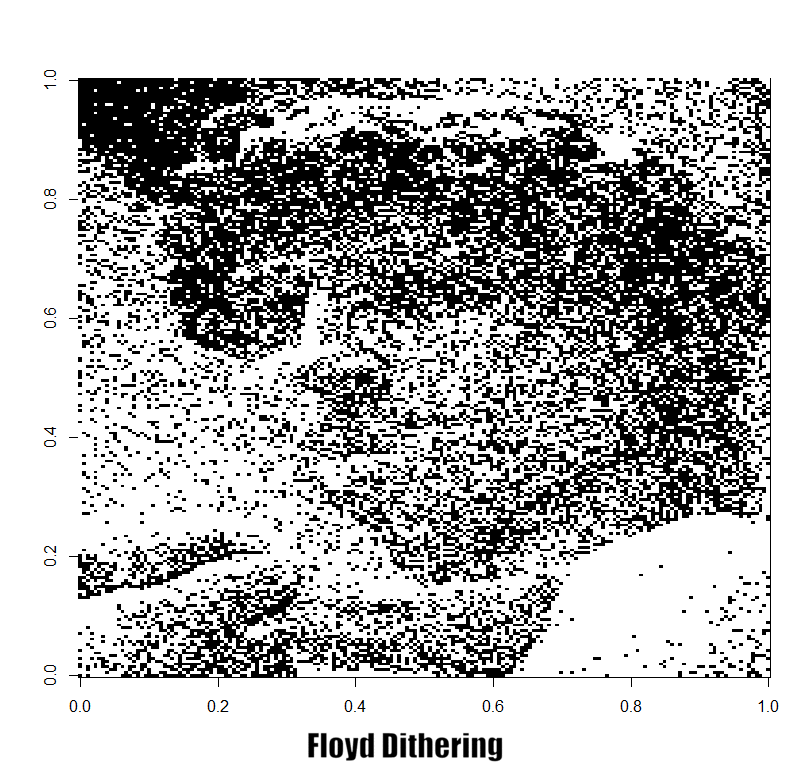
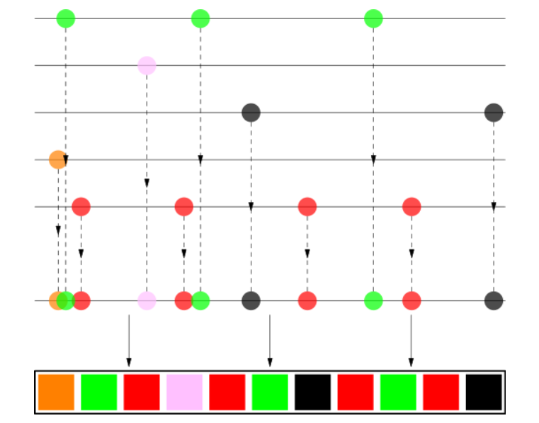

```r
library(tidyverse)
```
```
## Warning: package 'tidyverse' was built under R version 3.5.2
```

---
# How to Shuffle Songs?
---

## Introduction

이 페이지는 [How to shuffle Songs?](https://labs.spotify.com/2014/02/28/how-to-shuffle-songs/)를 번역 및 실습해보았다.

Spotify는 우리나라의 벅스, 멜론과 같은 스트리밍 회사이다. 여기서 유저들이 shuffling 기능을 사용했을 때, 같은 아티스트의 음악이 연이어 나온다고 불평했나보다. 유저들은 '같은 아티스트의 곡이 연이어서 나오는데?' Spotfy는 '우리 shuffling은 random맞는데?'

누가 맞는걸까? 이 페이지에서는 둘 다 맞지만, 좀 더 복잡한 스토리가 있다고 둘러댄다. 

* 이렇게하는거? 오 지리네

## Our perspective 

Spotify 회사가 launch된 이후로, 완벽한 random sampling을 이루기 위해 Fisher-Yates shuffle을 이용해왔다.
그런데, 문제는 다음 사진과 같은 플레이리스트가 나타날 확률이 같다는 것이다.

#
(여기서 같은 색의 점들은 같은 아티스트의 곡을 뜻한다.)


Spotify Lab에서는 이 Fisher-Yates shuffle이 3줄짜리 코딩으로 되고, randomness를 준다는 점에서 아름다운 알고리즘이라고 판단하나보다.


## Gambler's Fallacy
 이 문단에서 이제 앞서 shuffling이 랜덤하지 않다고 주장하는 유저들에 대한 비꼬기를 시전한다. 
 
 예를 들어, 동전을 아홉번 던졌는데 다 앞면이 나왔다고 해서 10번 째에 뒷면이 나오는게 아닌데, 그래도 뒷면 나올 확률이 더 높다고 생각하는 것이나
 
 또 다른 예로는 스크래치 복권을 두 번 연속 꽝에 당첨되었다고 해서 다음 번에는 좀 더 높은 확률로 당첨이 될거라고 생각하는 것
 
 이것들이 다 Gambler's Fallacy라는 거다. 모든 사건은 독립이니깐.
 
 같은 맥락에서, 유저가 만약 특정한 아티스트의 곡을 들었다고 해서, 다음번에는 다른 아티스트의 곡이 나올 확률이 높아지는 건 아니다. 랜덤의 관점에서는. 그러나,
 However, the old saying says that the user is always right, so we decided to look into ways of changing our shuffling algorithm so that the users are happier. 
 항상 유저말이 맞는거죠^^. 우리가 shuffling알고리즘을 바꿔야죠^^
 
## The Algorithm

 어떤 블로그에서 이미 이 주제에 다뤄본 적이 있는 듯하지만, 좀 느린거 같아서 다르게 생각해보았다.
 
 Main Idea는 Dithering이다. Dithering은 이미지 프로세싱에서 주로 쓰는 기법인데, 이 기법의 핵심은 error diffusion이다. 
 
 ==원래의 픽셀이 있고, quantization(양자화)을 한 픽셀이 있다고 치자. 그렇다면 이 차이(원래 픽셀-새로운 픽셀)가 quantization error가 되는데, 이 error를 한 픽셀에서만 감당하게 하지말고, 주위 이웃들에게 나누어 주는 것이다.==
 
 자, 나와있는 예를 통해서 설명해보자.
 
 다음과 같은 사진이 있다.
 
 #

이 사진을 딱 두 가지 색으로만 간단하게 만들고 싶다. 하얀색과 검은색. 

각 픽셀이 가지고 있는 흰색과 검은색의 비율을 확률로 이용해서, 점이 검은색이 될지 하얀색이 될지를 랜덤하게 결정한다.
만약 한 점이 80% 정도의 shade of gray를 가지고 있다면, 80%의 확률로 검은색이 되고 20%의 확률로 흰색이 되는 것이다.

```r
library(png)
```


```r
# 흑백사진이기 때문에 215 * 180 짜리 matrix 하나.
david = 'C:/Users/Phil2/Dropbox/DataScience/Kakao/michelangelodavid.png'
david_mat = readPNG(david); dim(david_mat)
[1] 215 180

# 컬러사진의 경우에는 RGB로 나타지기 때문에 dim을 했을 때 3이 추가로 나타난다.
mandrill = 'C:/Users/Phil2/Dropbox/DataScience/Kakao/mandrill.png'
mandrill_mat = readPNG(mandrill); dim(mandrill_mat)
[1] 480 480   3
```
각 픽셀마다 random sampling을 해줘야하기 때문에, 코드는 다음과 같다.

```r
# Random Sampling
m = nrow(david_mat)
n = ncol(david_mat)
david_mat_sampling = matrix(0, nrow = m, ncol = n)
for(i in 1:nrow(david_mat)){
  for(j in 1:ncol(david_mat)){
    david_mat_sampling[i,j] = sample(c(0,1), 1, prob = c(1-david_mat[i,j], david_mat[i,j]))
  }
}

image(rotate(david_mat), col = gray((0:32)/32))
rotate <- function(x) t(apply(x, 2, rev))
```
#


하지만 결과는 마음에 들지 않는다. 왜냐하면 검은색들끼리 cluster가 있고, 하얀색들끼리 cluster가 있기 때문이다. 
이것들을 좀 더 evenly하게 퍼트려줘야 만족스러울 것. 예를 들자면 [Floyd-Steinberg dithering](https://en.wikipedia.org/wiki/Floyd%E2%80%93Steinberg_dithering)과 같은 스킬이 있다.
이게 앞서 말한 error diffusion을 적용한 기술이다. 

#
비어있는 부분은 이미 scan되고 난 픽셀, \* 표시된 것이 현재 scan중인 픽셀이다. 현재 scan 중인 픽셀에서의 에러들을 **아직 scan되지 않은 픽셀들에게** diffuse, 나눠주는 것이다. 얼마씩? 저 숫자값들만큼. $\frac{7}{16}, \frac{3}{16}, \frac{5}{16}, \frac{1}{16}$

왜 diffuse를 하느냐? 이렇게 error를 diffuse하고나서 반올림을 하면, round down되는 픽셀이 있으면 그만큼 에러가 positive로 나타날 것이고, 그 픽셀의 이웃은 그 에러를 반영해서 round up이 될 것이기 때문이다. 
즉, 어느 하나가 round down되면 다른 것들은 round up될 확률이 높아져서, 위에서처럼 cluster가 생기지는 않는다.

그런데, 이 부분에서 매우 고민을 많이 한 것이 있다. 가장자리에 있는 픽셀들에 대해서는? 

1. 픽셀 매트릭스의 맨 왼쪽에 있는 픽셀들은, 왼쪽 아래의 픽셀이 없다. 
2. 픽셀 매트릭스의 맨 오른쪽에 있는 픽셀들은, 오른쪽의 픽셀과 오른쪽 아래의 픽셀이 없다.
3. 픽셀 매트릭스의 맨 아래에 있는 픽셀들은, 오른쪽을 제외한 나머지의 픽셀이 없다.

이런 문제들이 발생하는데, 아무리 찾아봐도 이러한 문제들에 대해서는 어떻게 한건지 나오질 않는다. 혼자서 고민을 좀 더 해봤는데, 예를 들어 2번의 문제의 경우 오른쪽의 픽셀이 없다면 그 다음 줄의 첫번째 픽셀에 에러를 diffuse하는게 맞나? 그런데 아닌 것 같았다. 주위 이웃들에게 에러를 diffuse한다는게 main idea인데, 그 다음 줄의 첫번째 픽셀은 거리상으로 주위 이웃이 아니기 때문이다.

열심히 찾아보니 [유튜브 영상](https://www.youtube.com/watch?v=0L2n8Tg2FwI&t=1527s)에서는 아예 그냥 가장자리를 빼고 하더라.(....쉽게 쉽게 갈껄 나도)

하지만 이미 알고리즘으르 만들고 난 후였다. 가장자리에 있는 픽셀들에 대해서는 있는만큼만 에러를 diffuse했다. 즉, 1번의 경우에는 왼쪽 아래의 픽셀이 없으니 그만큼은 버려졌다. 2번의 경우에는 오른쪽의 픽셀과 그 오른쪽 아래의 픽셀에 주어질 error들은 버려졌고. 

```r
david_mat_dithering = david_mat_sampling

for(i in 1:m){
  for(j in 1:n){
    old_pixel = david_mat[i,j]
    new_pixel = david_mat_dithering[i,j]
    quant_error = old_pixel - new_pixel
    # 픽셀 매트릭스의 맨 왼쪽에 있는 픽셀 부분
    if(j == 1){
      # 그 중에서도 맨 아래에 있는 픽셀 부분
      if(i == m){
        david_mat_dithering[i,j+1] = david_mat_dithering[i,j+1] + quant_error * 7/16
      }
      else{
        david_mat_dithering[i,j+1] = david_mat_dithering[i,j+1] + quant_error * 7/16
        david_mat_dithering[i+1,j] = david_mat_dithering[i+1,j] + quant_error * 5/16
        david_mat_dithering[i+1,j+1] = david_mat_dithering[i+1,j+1] + quant_error * 1/16
      }
    }
    # 픽셀 매트릭스의 맨 오른쪽에 있는 픽셀 부분
    else if(j == n){
      # 그 중에서도 맨 아래에 있는 픽셀 부분
      if(i == m){
      # 맨 마지막 픽셀이라는 것이니깐 더 이상 에러를 diffuse할 곳이 없다. 그래서 left blank
      }
      else{
        david_mat_dithering[i+1,j-1] = david_mat_dithering[i+1,j-1] + quant_error * 3/16
        david_mat_dithering[i+1,j] = david_mat_dithering[i+1,j] + quant_error * 5/16
      }
    }
    # 맨 왼쪽이나 맨 오른쪽에 있지 않은 픽셀 부분들에 대해서
    else{
      # 그 중에서 맨 아래에 있는 픽셀 부분들
      if(i == m){
        david_mat_dithering[i,j+1] = david_mat_dithering[i,j+1] + quant_error * 7/16
      }
      # 예외에 하나도 걸리지 않는 부분들에 대해선 원래대로.
      else{
        david_mat_dithering[i,j+1] = david_mat_dithering[i,j+1] + quant_error * 7/16
        david_mat_dithering[i+1,j-1] = david_mat_dithering[i+1,j-1] + quant_error * 3/16
        david_mat_dithering[i+1,j] = david_mat_dithering[i+1,j] + quant_error * 5/16
        david_mat_dithering[i+1,j+1] = david_mat_dithering[i+1,j+1] + quant_error * 1/16
      }
    }
  }
}
david_mat_dithering = round(david_mat_dithering)
```

그런데 이러고 나면 0과 1만으로 나누어 떨어져야하는데, 에러를 하도 받아서 그런가 -1이나 2가 나오기도 한다.
-1의 경우에는 0으로, 2의 경우에는 1로 바꿔주자.
```r
table(david_mat_dithering)  # -1 or 2 occurs!
david_mat_dithering
   -1     0     1     2 
  370 15977 21898   455 
david_mat_dithering[david_mat_dithering == -1] = 0; david_mat_dithering[david_mat_dithering == 2] = 1
table(david_mat_dithering) # No more -1 or 2
david_mat_dithering
    0     1 
16347 22353 
```
이러고 나서 다시 plot을 해보면, 

```r
image(rotate(david_mat_dithering), col = gray((0:32)/32))
```
#

음...생각보다 별로 안 달라진 것 같지만, gif로 만들어보면 꽤 달라진 모습을 볼 수 있다...cluster들이 많이 사라진 것을 확인할 수 있다.

그런데 [Floyd-Steinberg dithering](https://en.wikipedia.org/wiki/Floyd%E2%80%93Steinberg_dithering)에 나온 사진만큼은 아니고..알고리즘이 잘못된 것 같진 않은데 뭐가 문제인지 잘 모르겠다. 분명 하란대로 다 했는데.

#

그래도 꽤 달라진게 보이긴 한다.

## Shuffle Songs
다시 본론으로 돌아오면, 음악을 shuffling하는 것도 위 사진 때와 같이 cluster을 없애는 문제로 생각하자는 것이다.
같은 아티스트의 곡들이 cluster라면, 이걸 playlist 전체에다가 고르게 퍼트리는 것이다.	

The White Stripes의 곡들은 빨간색, The xx의 곡들은 검은색, Britney Spears의 곡들은 핑크색, Jaga Jazzist의 곡들은 주황색이다.
이 곡들을 다음과 같이 '뿌려서' playlist를 만드는 것이다.
#

예를 들어, The White Stripes의 곡들, 빨간색 곡들은 총 4개가 있는데, 이걸 playlist 전반에 고르게 퍼트린 것을 볼 수 있다.
1. 하지만 4곡이라고 해서 딱 25%의 길이만큼 맞춘 것은 아니고, 20~30%가 되게끔. (roughly 25%)
2. 그리고 각 아티스트의 시작점도 조금씩 다르게 잡아줘야 한다. 모두 다 시작점이 0이면 안 됨. (random offset)
3. 같은 아티스트의 곡들도 shuffle해줘야함. 예를 들어서 같은 앨범에서 나온 곡들은 너무 겹치지 않게 해준다거나 하는 식으로.


```python
```


ㅇㅇ
