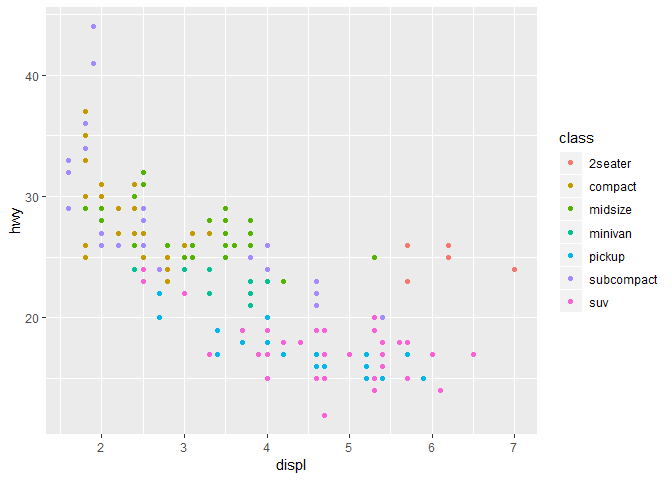
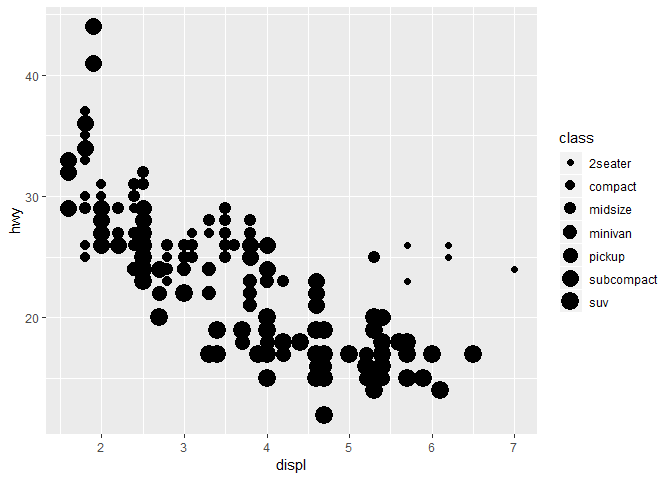
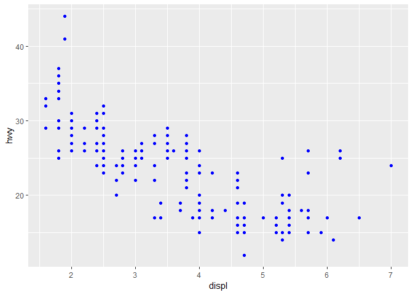

03 Data Visualisation
================

3.1 Introduction
----------------

> "간단한 그래프가 다른 어떤 도구보다 데이터 애널리스트에게 많은 정보를 전달해준다." - 존 튜키 <br /> “The simple graph has brought more information to the data analyst’s mind than any other device.” — John Tukey

이 chapter에서는 ggplot2를 이용해, 데이터를 어떻게 visualise할지 알려준다. <br /> R에는 그래프를 만들어주는 몇 가지 시스템들이 있지만, ggplot2는 가장 우아하고 다재다능하다.

ggplot2는 **그래픽의 문법**을 구현implement했다. <br /> 그래프를 만들고 묘사하는데 있어, 일관적인 시스템을 정립했음. <br /> ggplot2와 함께라면, 하나의 시스템만을 배워서 더 빠르게, 그리고 많은 곳에 응용할 수 있다.

시작하기 전에, ggplot2의 이론적인 근거들을 더 배우고 싶다면, <br /> [The Layered Grammar of Graphics](http://vita.had.co.nz/papers/layered-grammar.pdf) 이걸 읽기를 추천한다.

### 3.1.1 Prerequisites

이 chapter에서는, tidyverse의 핵심 멤버 중 하나인, ggplot2에 집중할 것이다. <br /> 데이터셋을 접근하고, 필요한 함수를 사용하기 위해서, tidyverse를 로드하자.

``` r
library(tidyverse)
```

이 코드 한줄로 핵심 tidyverse를 로드할 수 있다. <br /> 거의 모든 데이터 분석에서 사용할 패키지들이다. (실제로 없으면 안 되는 수준이다.) <br /> base R 혹은 로드한 다른 패키지들의 함수와, 이름이 같아서 충돌하는지도 알려준다.

만약에 이 코드를 실행했는데, "there is no package called 'tidyverse'"라는 에러 메시지가 나오면, <br /> 먼저 설치를 해야한다. 그리고 나서 `library()`를 다시 실행해야 한다.

``` r
install.packages("tidyverse")
library(tidyverse)
```

패키지 설치는 처음 한 번만 하면 되는데, 패키지를 로드 하는 것은 세션을 시작할때마다 해줘야 한다. <br /> (독자가 beginner라고 가정하고 설명을 해놓은듯..)

어떤 함수가 어디에서 왔는지를 명시해주고 싶다면, `package::function()`이라는 특별한 형식으로 사용해줘야 한다. <br /> 예를 들어, `ggplot2::ggplot()`라고 하면, <br />   우리가 ggplot2라는 패키지에서 `ggplot()`이라는 함수를 사용하고 있다는 걸 뜻한다.

------------------------------------------------------------------------

3.2 First steps
---------------

다음의 질문을 대답하는데 있어, 첫 번째 그래프를 사용해 볼 것이다. <br /> 큰 엔진을 사용하는 차들이, 작은 엔진을 사용하는 차들보다 기름을 많이 먹을까? <br /> Do cars with big engines use more fuel than cars with small engines? <br /> 이미 답을 알고 있을수도 있지만, 더 정확하게 답을 알아보자. <br /> 엔진 사이즈와 연비(fuel efficiency)는 어떤 관계가 있을까? 양의 관계? 음의 관계? 선형? 비선형?

### 3.2.1 The mpg data frame

ggplot2 패키지에 있는 `mpg`라는 데이터 프레임을 이용해서 답을 찾을 수 있다. <br /> 데이터 프레임은, 변수들variables을 열(column)에, 관측치들observations을 행(row)에 저장해놓은 네모난 컬렉션. <br /> `mpg`는 US Environmental Protection Agency가 모은 38개 모델의 차들에 대해 관측치들을 가지고 있다.

``` r
mpg
## # A tibble: 234 x 11
##    manufacturer model displ  year   cyl trans drv     cty   hwy fl    class
##    <chr>        <chr> <dbl> <int> <int> <chr> <chr> <int> <int> <chr> <chr>
##  1 audi         a4      1.8  1999     4 auto~ f        18    29 p     comp~
##  2 audi         a4      1.8  1999     4 manu~ f        21    29 p     comp~
##  3 audi         a4      2    2008     4 manu~ f        20    31 p     comp~
##  4 audi         a4      2    2008     4 auto~ f        21    30 p     comp~
##  5 audi         a4      2.8  1999     6 auto~ f        16    26 p     comp~
##  6 audi         a4      2.8  1999     6 manu~ f        18    26 p     comp~
##  7 audi         a4      3.1  2008     6 auto~ f        18    27 p     comp~
##  8 audi         a4 q~   1.8  1999     4 manu~ 4        18    26 p     comp~
##  9 audi         a4 q~   1.8  1999     4 auto~ 4        16    25 p     comp~
## 10 audi         a4 q~   2    2008     4 manu~ 4        20    28 p     comp~
## # ... with 224 more rows
```

`mpg`에 있는 변수들 중 몇 가지만 설명해보면:

1.  `displ`는 차의 엔진 사이즈다. 리터로.

2.  `hwy`는 고속도로 위에서 차의 연비. miles per gallon으로 mpg. <br /> 이 값이 낮으면 연비가 더 안 좋다는거지 뭐.

`mpg`에 대해서 더 배우고 싶다면, `?mpg`를 통해서 help page를 봐라.

### 3.2.2 Creating a ggplot

`mpg`를 그려보기 위해서는, `displ`을 x축에 놓고, `hwy`를 y축으로 놓는 다음의 코드를 실행해보자.

``` r
ggplot(data = mpg) + 
  geom_point(mapping = aes(x = displ, y = hwy))
```


이 그래프는, 엔진 사이즈(`displ`)와 연비(`hwy`)간에 음의 관계가 있다는 것을 보여준다. <br /> 다른 말로 하면, 엔진이 큰 차는 기름을 더 먹는다는 것이다. <br /> 그럼 이게, 엔진 사이즈와 연비간의 관계에 대한 우리의 가설을 지지하는가 아님 반대하는가?

ggplot2을 사용할 때면, `ggplot()`이라는 함수와 함께 그래프를 그리기 시작하는 것이다. <br /> `ggplot()`는 레이어들layers을 쌓아갈 수 있는 coordinate system을 만들어준다. <br /> `ggplot()`의 첫 번째 인자argument는, 그래프를 그릴 때 사용할 데이터셋이다.

그래서 `ggplot(data = mpg)`는 텅 빈 그래프를 만들어준다. 여기서는 보여지는게 아무것도 없다.

`ggplot()`에 레이어를 하나씩 하나씩 더해가면서 원하는 그래프를 완성하는 것이다. <br /> `geom_point()`라는 함수는 그래프에다 포인트를 더해준다. 그래서 scatterplot을 만들어주는 것. <br /> `geom_`으로 시작하는 엄청 많은 함수들이 있고, 이 chapter를 배워나가면서 배워나가게 될 것이다.

ggplot2의 각 geom 함수들은 `mapping` argument를 받는다. <br /> 이 argument가 데이터셋에 있는 변수들을 어떻게 시각적visual으로 map해줄지를 정해준다. <br /> mapping argument는 항상 `aes()`라는 것과 짝을 이룬다. <br /> `aes()`안에는 `x`와 `y` argument들이 어떤 변수를 x축과 y축으로 map할건지를 정해준다.

### 3.2.3 A graphing template

이 코드를, ggplot2을 이용해서 그래프를 만들 수 있는, 재사용한 템플릿resuable template으로 만들어보자. <br /> 아래에 보이는 코드에서, &lt;&gt;로 감싸진 부분은, 원하는 것으로 대체할 수 있다.

``` r
ggplot(data = <DATA>) +
    <GEOM_FUNCTION>(mapping = aes(<MAPPINGS>))
```

남은 chapter에서는, 다른 타입들의 그래프를 만드는데 있어, <br />   이 템플릿을 어떻게 완성하고 확장시킬것인지를 보여줄 것이다. <br /> `<MAPPINGS>` 부분부터 시작해보자.

### 3.2.4 Exercises

3.3 Aesthetic mappings
----------------------

> "그림의 가장 중요한 가치는, 우리가 기대하지도 않았던 것을 알아차리게 한다는 점이다." - 존 튜키

밑의 그래프를 보면, 한 그룹의 포인트들이(빨간색으로 표시된) 선형적 추세에서 떨어져 있는 것을 볼 수 있다. <br /> 이 차들은 우리가 예상했던 것보다 더 좋은 연비를 가지고 있다. <br /> 이 차들이 왜 그런지를 설명할 수 있을까? 

이 차들이 하이브리드라고 가정해보자. <br /> 이 가정을 테스트해볼 한 가지 방법은, 각 차들의 `class`를 확인해보는 것이다. <br /> `mpg` 데이터셋의 `class` 변수는, 차들을 compact, midsize, SUV로 분류해준다. <br /> 만약에 저 outlying 포인트들이 하이브리드라면, compact cars나 subcompact cars로 분류가 되어야한다. <br /> (이 데이터는 하이브리드 트럭이나 SUV가 popular해지기 전에 모아졌다는 것을 인지해두자.)

이제 여기서, `class`라는 세 번째 변수를, **aesthetic**으로 mapping해서, 2차원의 scatterplot에 추가할 수 있다. <br /> aesthetic은, 그래프에서 오브젝트가 어떻게 표현이 될지 시각적 특징visual property이다. <br /> aesthetics는 사이즈, 모양shape, 색을 포함한다.

aesthetic 특성들 값을 변화시키면서, 아래와 같이 포인트들의 모양을 바꿀 수 있다. <br /> 데이터를 묘사하기 위해 "값value"이라는 단어를 사용했으니깐, <br />   aesthetic 특성들 값을 지칭하기 위해서는 "레벨level"이라는 단어를 사용하겠다.

아래에서, 포인트의 사이즈를 바꾸기도, 모양을 바꾸기도, 색을 바꾸기도 해보았다.


데이터셋의 변수들을 aesthetics로 mapping해서, 데이터에 대한 정보를 전달할 수 있다. <br /> 예를 들어, `class` 변수에, 색을 map해서 각 차들이 어떠한 클래스인지를 보이게 할 수도 있다.

``` r
ggplot(data = mpg) + 
    geom_point(mapping = aes(x = displ, y = hwy, color = class))
```

 (Hadley와 같이 영국식 영어를 더 좋아한다면, `color` 대신에 `colour`를 사용해도 된다.)

변수에 aesthetic을 map하기 위해서는, 위에서 했던 것같이, <br />   `aes()`안에서 변수의 이름과 aesthetic의 이름을 연관시켜라. ggplot2는 자동적으로 '변수의 unique한 값들'에다가 'aesthetic의 unique한 레벨들'을 할당할 것이다. <br /> 이 과정process은 **scaling**이라고 알려져있다. <br /> ggplot2는 또한 그래프 옆에, 어떤 레벨이 어떤 값과 연관되어 있는지, legend도 추가해준다.

자, 그럼 위에서 봤던 그 outlying points는 무엇이었냐? <br /> 색깔을 보면 알 수 있듯이, two-seater 차들이었다. <br /> 이 차들은 하이브리드가 아니고, 스포츠카였다! <br /> 스포츠카들은 SUV나 픽업 트럭과 같은 큰 엔진을 가지고 있지만, <br />   midsize나 compact 차들과 같은 작은 자체를 가지고 있어서, 연비가 좋았던 것이다. <br /> 지나고나서보니깐in hindsight, 이러한 차들은 큰 엔진을 갖고 있기 때문에 하이브리드 차가 아니다.

위의 예를 보면, `class` 변수를 color aesthetic에다가 map을 했는데, <br />   비슷한 방법으로 size aesthetic에다가 map을 할 수도 있다.

``` r
ggplot(data = mpg) + 
    geom_point(mapping = aes(x = displ, y = hwy, size = class))
```

    ## Warning: Using size for a discrete variable is not advised.

 그래프를 보면 알겠지만, 구별이 잘 안된다. warning도 뜬다. <br /> 이렇게 순서가 없는 변수unordered variable을 ordered aesthetic로 mapping하는 것은 좋은 방법이 아니다. <br /> `class`라는 unordered variable을, `size`라는 ordered aesthetic으로 mapping하는 건 좋은 생각이 아니라고.

이런 식으로 `class` 변수를 alpha aesthetic(투명성transparency 조절), shape aesthetic으로 전달할 수 있다.

``` r
ggplot(data = mpg) +
    geom_point(mapping = aes(x = displ, y = hwy, alpha = class))

ggplot(data = mpg) +
    geom_point(mapping = aes(x = displ, y = hwy, shape = class))
```


그런데, shape aesthetic을 사용한 그래프에서, SUV들은 어디로 간거지? <br /> ggplot2는 한 번에 여섯 개의 shapes까지만 사용할 수 있다. <br /> 그래서 디폴트로, 이 숫자 이상의 그룹들은 그려지지 않는다.

각 aesthetic에 대해, `aes()`를 사용해서 변수와 aesthetic의 이름들을 연결시킬 수 있다. <br /> `aes()` 함수는, 레이어에서 사용되는 각 aesthetic mapping 모아서, layer의 mapping argument로 전달한다. <br /> 이것의 문법syntax는 `x`, `y`에 무엇이 위치하게 되고, 변수를 map하는데 어떠한 시각적 특징을 이용했는지 강조한다.

aesthetic을 map하게 되면, ggplot2가 나머지를 알아서해준다. <br /> 합리적인 scale을 정해주고, 레벨들과 값을 설명해주는 legend도 만들어준다. <br /> x, y 축에 뭐가 있는지에 대해서는 legend를 만들지는 않지만, 라벨을 만들어준다. <br /> axis 선은, location과 값을 mapping한 것을 설명한다는 점에서, legend와 같이 행동한다.

당연히, geom의 aesthetic 특성들을 매뉴얼하게 설정할 수도 있다. <br /> 예를 들어, 모든 점들을 파란색으로 만들 수도 있다.

``` r
ggplot(data = mpg) +
    geom_point(mapping = aes(x = displ, y = hwy), color = "blue")
```



여기서, 색은 변수에 대한 어떠한 정보도 전달해주지 못하고, 그냥 외형만 바꿔준다. <br /> aesthetic을 매뉴얼하게 정하기 위해서는, 위의 코드처럼 `aes()` 밖에다가 두어야한다.

그 aesthetic이 말이 되게끔 레벨level을 정해주어야 한다. <br /> - 색은 'character string'으로. <br /> - 사이즈는 mm으로. <br /> - 모양shape은 다음 그림에 나와있는 숫자로.


이 25개의 shape들은 숫자로 구분되어 있다. <br /> 몇몇 중복들duplicates이 있는 것으로 보인다. 예를 들어, 0, 15, 22는 전부 네모다. <br /> 차이점은, `colour`와 fill aesthetic들이랑 상호작용할 수 있는지에 있다. <br /> 텅 빈 shape들, (0 - 14)는 경계선이 `colour`로 결정될 수 있다. <br /> solid한 shape들, (15 - 18)은 `colour`로 색을 채울fill 수 있다. <br /> 색이 찬 shape들, (21 - 24)는 경계선을 `colour`로, 색을 `fill`로 채울 수 있다.

### 3.3.1 Exercises

3.4 Common problems
-------------------
