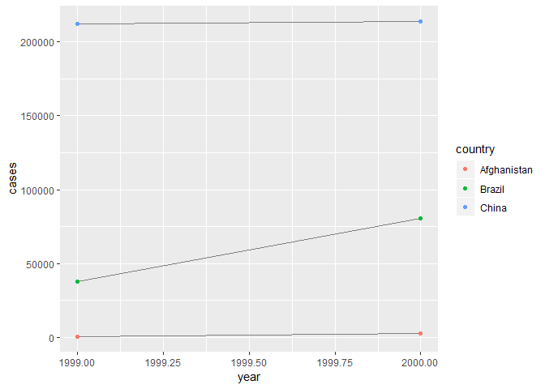

12 Tidy data
================

12.1 Introduction
-----------------

> "행복한 가정은 다 비슷비슷하다. 모든 불행한 가정은 다 가지각색으로 불행하다." - 레오 톨스토이 "Tidy 데이터셋은 다 비슷비슷하다. 모든 지저분한 데이터들은 다 가지각색으로 지저분하다." - Hadley Wickham

이 chapter에서는, R의 데이터를 organise하는 consistent 방법에 대해서 배울 것이다. <br /> 이 구조가 tidy data이다.

너의 데이터를, 이러한 포맷으로 만드는건 선불의upfront 작업을 필요로 한다. 근데 가치가 있는 일임. <br /> 이러한 tidy data랑 tidy tools를 잘 쓰면, 데이터를 어떠한 표현에서 다른 표현으로 개조하는데에, <br /> 시간을 훨씬 적게 쓰게 될거다. 그리고 그만큼 분석하는데에 시간을 더 쓸 수 있고.

이 단원은 tidy data에 대한 실용적인 소개와 tidyr에 딸려있는 도구들에 대해 설명

### 12.1.1 Prerequisites

tidyr이라는 패키지를 사용할 것인데, 이건 tidyverse의 코어 중 하나다. <br /> 그래서 tidyverse만 로드하면 된다.

``` r
library(tidyverse)
```

------------------------------------------------------------------------

12.2 Tidy data
--------------

같은 데이터를 여러가지 방법으로 표현represent할 수 있다. <br /> 다음 예는 같은 데이터를 4가지 다른 방법으로 organise하는 것을 보여준다. <br /> 각 데이터셋은 4가지 변수country, year, population, cases에 대한 같은 값을 보여주지만, <br />     다른 방법으로 organise되어있다.

``` r
table1
## # A tibble: 6 x 4
##   country      year  cases population
##   <chr>       <int>  <int>      <int>
## 1 Afghanistan  1999    745   19987071
## 2 Afghanistan  2000   2666   20595360
## 3 Brazil       1999  37737  172006362
## 4 Brazil       2000  80488  174504898
## 5 China        1999 212258 1272915272
## 6 China        2000 213766 1280428583
table2
## # A tibble: 12 x 4
##    country      year type            count
##    <chr>       <int> <chr>           <int>
##  1 Afghanistan  1999 cases             745
##  2 Afghanistan  1999 population   19987071
##  3 Afghanistan  2000 cases            2666
##  4 Afghanistan  2000 population   20595360
##  5 Brazil       1999 cases           37737
##  6 Brazil       1999 population  172006362
##  7 Brazil       2000 cases           80488
##  8 Brazil       2000 population  174504898
##  9 China        1999 cases          212258
## 10 China        1999 population 1272915272
## 11 China        2000 cases          213766
## 12 China        2000 population 1280428583
table3
## # A tibble: 6 x 3
##   country      year rate             
## * <chr>       <int> <chr>            
## 1 Afghanistan  1999 745/19987071     
## 2 Afghanistan  2000 2666/20595360    
## 3 Brazil       1999 37737/172006362  
## 4 Brazil       2000 80488/174504898  
## 5 China        1999 212258/1272915272
## 6 China        2000 213766/1280428583

# 2개의 tibble에 나누어서 표현되어 있는,
table4a
## # A tibble: 3 x 3
##   country     `1999` `2000`
## * <chr>        <int>  <int>
## 1 Afghanistan    745   2666
## 2 Brazil       37737  80488
## 3 China       212258 213766
table4b
## # A tibble: 3 x 3
##   country         `1999`     `2000`
## * <chr>            <int>      <int>
## 1 Afghanistan   19987071   20595360
## 2 Brazil       172006362  174504898
## 3 China       1272915272 1280428583
```

다 같은 데이터에 대한 표현인데, 다 똑같이 사용하기 쉬운건 아니다. <br /> 하나의 데이터셋인, 'tidy 데이터셋'이, tidyverse안에서 작업하기 훨씬 쉽다.

dataset을 tidy하게 만드는 3가지 interrelated rules가 있다. <br /> 1. 각 변수는 항상 own 칼럼을 가져야 한다. <br /> 2. 각 관측치는 항상 own 행을 가져야 한다. <br /> 3. 각 값은 항상 own 셀을 가져야 한다.

Figure 12.1가 이걸 visually하게 보여준다. 

3개의 룰 : 변수는 칼럼에, 관측치는 행에, 값은 cell에.

이 3가지 룰은 interrelated되어있다. 왜냐하면 3개 중에 2개만 갖는 것은 불가능하기 때문. <br /> 그래서, 다음과 같이 더 간단한 실용적인 룰들을 정할 수 있다.

1.  각 데이터셋을 tibble에다 넣어라. <br />
2.  각 변수를 칼럼에다 넣어라. <br /> 이 예시에서, `table1`만이 tidy하다. each column이 변수인 유일한 표현이다.

왜 tidy하게 만들어야 되냐? 2가지 장점이 있다. <br /> 1. 데이터를 저장하는데 있어, one consistent way를 정하는거에 일반적인 장점이 있다. <br /> 만약 너가 일관성 있는 데이터 구조를 갖고 있다면, <br />     underlying하는 통일성이 있어서, 그걸 다루는 툴을 배우는게 쉽다.

1.  변수를 칼럼에다 놓으면, 특정한 장점이 있다. 왜냐하면 이게 R의 벡터화된 본성이 빛나게 하기 때문. <br /> mutate와 summary functions에서 배웠듯이, 거의 모든 R built-in 함수들은 벡터의 값들과 연동. <br /> 그래서, tidy data를 transforming하는게 특히나 자연스럽게 느껴지게 된다.

tidyverse에 있는 dplyr, ggplot2 그리고 다른 패키지들은 tidy data와 작업할 수 있게끔 디자인되었다. <br /> table1과 어떻게 작업할 수 있는지, 예들이 있음.

``` r
# rate per 10,000을 구하고 싶다면,
table1 %>%
    mutate(rate = cases / population * 10000)
## Warning: The `printer` argument is deprecated as of rlang 0.3.0.
## This warning is displayed once per session.
## # A tibble: 6 x 5
##   country      year  cases population  rate
##   <chr>       <int>  <int>      <int> <dbl>
## 1 Afghanistan  1999    745   19987071 0.373
## 2 Afghanistan  2000   2666   20595360 1.29 
## 3 Brazil       1999  37737  172006362 2.19 
## 4 Brazil       2000  80488  174504898 4.61 
## 5 China        1999 212258 1272915272 1.67 
## 6 China        2000 213766 1280428583 1.67

# cases per year을 구하고 싶다면
table1 %>%
    count(year, wt = cases)
## # A tibble: 2 x 2
##    year      n
##   <int>  <int>
## 1  1999 250740
## 2  2000 296920

# visualise changes over time을 하고 싶다면
ggplot(table1, aes(year, cases)) +
    geom_line(aes(group = country), color = "grey50") +
    geom_point(aes(colour = country))
```



### 12.2.1 Exercises

------------------------------------------------------------------------

12.3 Spreading and gathering
----------------------------

tidy data의 원리는 너무나 명확해서, 가끔 너는 이런 생각을 할거다. <br /> 안 그런 데이터가 있나? 그러나 대부분이 untidy하다. 2가지 주요 이유가 있다.

1.  대부분의 사람들이 tidy data의 원리를 잘 알고 있는 건 아니기 때문에, 혼자 힘으로 이걸 derive하기는 힘들다. <br />     데이터와 작업하는데 많은 시간을 쏟아부은 사람이 아닌 이상ㅇㅇ <br />
2.  보통 데이터라는게 분석을 위해서가 아니라 다른 목적을 위해서 organise되었기 때문. <br />     예를 들어서, 데이터는 보통 entry를 최대한 쉽게 만드려고 organise되었다.

이 말인즉슨, 실제 분석을 위해서는, tidying 작업이 필요하다는거.

첫 번째 단계는 무엇이 변수고 무엇이 관측치인지를 판단하는 것. <br /> 가끔은 이게 쉬운데, 때로는 데이터를 구성한 사람과 consult할 필요가 있다.

두 번째 단계는, 2가지 일반적인common 문제중 하나를 풀어야 한다. <br /> 1. 하나의 변수가 여러 개의 칼럼에 퍼져있다.spread across <br /> 2. 하나의 관측치가 여러 개의 행에 퍼져있다.scattered across

보통은 데이터셋이 둘 중 하나의 문제점만 가지고 있는데, 재수 없으면 둘 다 있다. <br /> 이 문제를 해결하기 위해서는, tidyr에서 가장 중요한 2개의 함수가 필요하다. <br /> `gather()`과 `spread()`

### 12.3.1 Gathering

데이터셋의 흔한 문제는 칼럼이름이 변수이름이 아니라는 거. 그럼 변수이름이 아니고 뭐냐? <br /> 변수값. 칼럼이름이 변수값. <br /> `table4a`를 봐보자. 칼럼 이름이 `1999`이고 `2000`이다. `year`이라는 변수의 '값'을 나타내고 있다. <br /> 그리고 각 행이 2개의 관측치를 표시하고 있다. 하나가 아니고.

이러한 데이터셋을 tidy하기 위해서는, 칼럼들을 한 쌍의 변수로 **gather**할 필요가 있다. <br /> 이 작업을 묘사하기 위해서 3개의 parameters가 필요하다.

1.  set of columns가 변수가 아닌 값을 나타내고represent 있다. 이 예에서는, `1999`과 `2000`이라는 칼럼들. <br />
2.  '칼럼이름들을 구성하고 있는 값'들의 변수 이름. `key`라고 하는데, 여기서는 `year`다. <br /> (`1999`과 `2000`이라는 변수값을 -&gt; `year`라는 변수이름으로) <br />
3.  셀들에 퍼져있는 값들을 변수이름으로. `value`라고 하는데, 여기서는 number of `cases`다. <br /> (745, 2666라는 값들을 -&gt; `cases`라는 변수이름으로)

이제 이 parameters들, 1999, 2000, years, cases들을 `gather()`로 호출한다.

``` r
table4a %>%
    gather(`1999`, `2000`, key = "year", value = "cases")
## # A tibble: 6 x 3
##   country     year   cases
##   <chr>       <chr>  <int>
## 1 Afghanistan 1999     745
## 2 Brazil      1999   37737
## 3 China       1999  212258
## 4 Afghanistan 2000    2666
## 5 Brazil      2000   80488
## 6 China       2000  213766
```

`dplyr::select()`에서 했던 스타일로 칼럼들을 gather한 것을 볼 수 있다. <br /> 이 경우에는 칼럼이 2개 뿐이여서, 개별적으로 리스트를 했다. <br /> 그리고 "1999"랑 "2000"은 non-syntactic names라서, backtick으로 감싸놓은 것을 볼 수 있다. <br /> 칼럼들 select하는게 기억이 안 난다면, [select]()를 다시 봐보자.

최종 결과물을 보면, gathered된 칼럼들은 사라지고, 새로운 key와 value라는 칼럼들을 얻었다. <br /> 반면에, 원래 변수들과의 관계는 보존되어 있다. <br /> Figure 12.2에 이 관계가 나타나있다. 

`table4b`도 비슷한 방법으로 `gather()`할 수 있다. <br /> 다른 점은, cell에 cases가 아닌 population이 저장되어 있는 것 뿐.

``` r
table4b %>%
    gather(`1999`, `2000`, key = "year", value = "population")
## # A tibble: 6 x 3
##   country     year  population
##   <chr>       <chr>      <int>
## 1 Afghanistan 1999    19987071
## 2 Brazil      1999   172006362
## 3 China       1999  1272915272
## 4 Afghanistan 2000    20595360
## 5 Brazil      2000   174504898
## 6 China       2000  1280428583
```

`table4a`와 `table4b`를 tided된 하나의 tibble로 combine하기 위해서, `dplyr::left_join()`을 쓴다.

``` r
tidy4a <- table4a %>%
    gather(`1999`, `2000`, key = "year", value = "cases")
tidy4b <- table4b %>%
    gather(`1999`, `2000`, key = "year", value = "population")

left_join(tidy4a, tidy4b)
## Joining, by = c("country", "year")
## # A tibble: 6 x 4
##   country     year   cases population
##   <chr>       <chr>  <int>      <int>
## 1 Afghanistan 1999     745   19987071
## 2 Brazil      1999   37737  172006362
## 3 China       1999  212258 1272915272
## 4 Afghanistan 2000    2666   20595360
## 5 Brazil      2000   80488  174504898
## 6 China       2000  213766 1280428583
```

이러한 join은 [relational data](https://blog-for-phil.readthedocs.io/en/latest/R%20for%20Data%20Science/13-Relational-data/)에서 배우게 될 것이다.

그러니깐 gathering은, 칼럼에 변수가 있어야되는데 값이 있을 때 쓰는 것.

### 12.3.2 Spreading

spreading은 gathering의 반대다. 관측치들이 multiple 행들에 퍼져있을 때 쓴다. <br /> 예를 들어서, `table2`를 보자. <br /> 관측치는 한 해의 한 국가인데, 각 관측치들이 2줄에 걸쳐 퍼져 있는 걸 볼 수 있다.

이걸 tidy하기 위해서, 먼저 `gather()`과 비슷한 방법으로 분석한다. 하지만 이번에 2개의 params만 필요. <br /> 1. 변수 이름을 가지고 있는 칼럼. `key` 칼럼. 여기서는 `type` <br /> 2. 다양한 변수로부터 나온 값들을 가지고 있는 칼럼. `value` 칼럼. 여기서는 `count`

이걸 알아냈으면, `spread()`를 이용하자. <br /> 어떻게 작동하고 있는건지는 Figure 12.3으로 볼 수 있다. 

``` r
table2 %>%
    spread(key = type, value = count)
## # A tibble: 6 x 4
##   country      year  cases population
##   <chr>       <int>  <int>      <int>
## 1 Afghanistan  1999    745   19987071
## 2 Afghanistan  2000   2666   20595360
## 3 Brazil       1999  37737  172006362
## 4 Brazil       2000  80488  174504898
## 5 China        1999 212258 1272915272
## 6 China        2000 213766 1280428583
```

공통된 `key`와 `value`라는 arguments에서 볼 수 있듯이, `spread()`와 `gather()`는 보충관계다. <br /> `gather()`는 wide tables를 좁고 길게 만들고, `spread()`는 long tables를 짧고 넓게 만든다.

그러니깐 spreading은, 관측치들이 2줄에 걸쳐 퍼져있을 때, key와 value를 이용해서.

### 12.3.3 Exercises

------------------------------------------------------------------------

12.4 Separating and uniting
---------------------------

이 때까지는 `table2`, `table4`를 tidy하는 법에 대해 배웠다. `table3`은 안 했다. <br /> 얘는 약간 다른 문제를 가지고 있기 때문. 얘는 하나의 칼럼이 2개의 변수를 가지고 있다. <br /> `rate`라는 칼럼이 `cases`와 `population`라는 변수를 가지고 있음.

이 문제를 해결하기 위해서, `separate()`라는 함수가 필요하다. 이것의 complement인 `unite()`도 배울 것. <br /> 이건 만약 하나의 변수가 multiple columns에 퍼져있을 때 쓰는 것.
