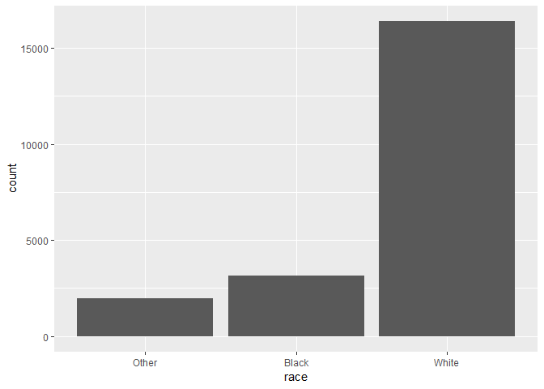
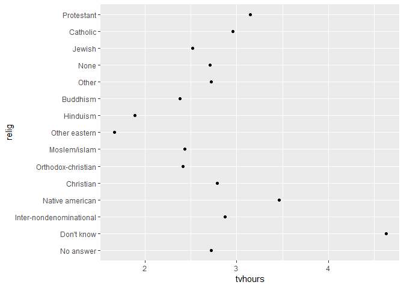
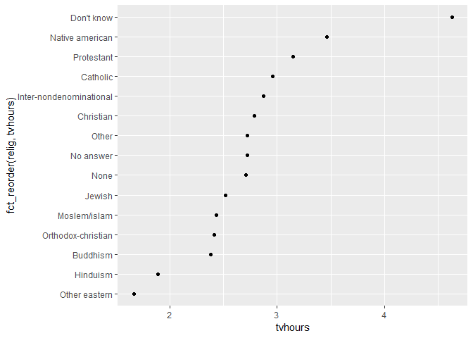
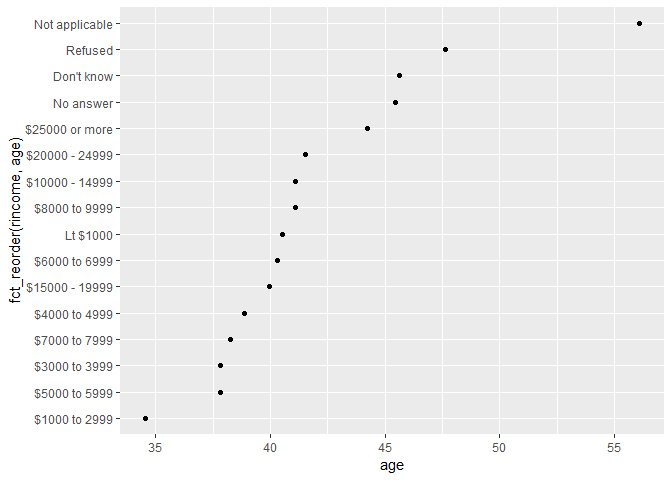
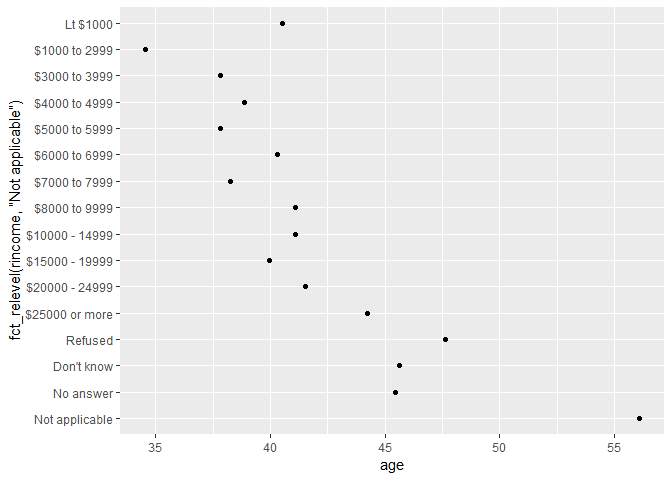
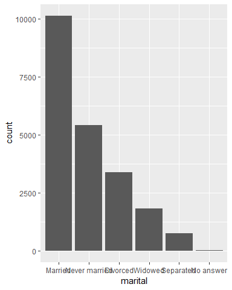
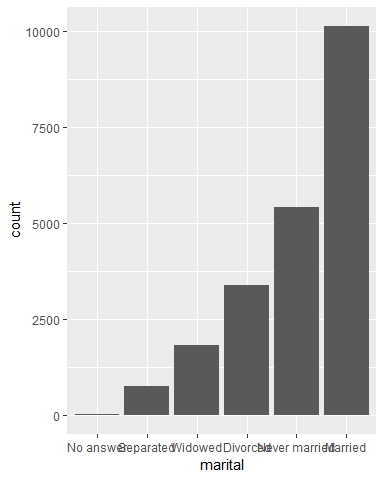

15 Factors
==========

------------------------------------------------------------------------

15.1 Introduction
-----------------

R에서, factors는 categorical 변수들을 작업하기 위해서 쓰인다. <br />     이 변수들이란? fixed, known set of possible values. <br />     가능한 값들이 미리 정해져있고, 알려져 있는 것. <br /> 또한, character vectors를 알파벳 순이 아닌 것non-alphabetical order으로 표현하고 싶을 때 유용하다.

역사적으로, factors가 characters보다 더 작업하기 쉽다. <br /> 그래서 base R의 많은 함수들은, characters를 자동적으로 factors로 바꾼다. <br />     이 말인즉슨, factors가 불쑥 튀어나와 별 도움이 안 되는 경우가 있다. <br /> 그런 일은 tidyverse에서 일어나지 않는다. 그냥 factors가 정말로 유용한 상황에만 집중하면 된다.

15.1.1 Prerequisites
--------------------

factors를 다루기 위해서, forcats 패키지를 사용할 것이다. <br />     categorical variables을 다루는데 필요한 도구들을 제공해줌. <br /> **for cat**egorical이랍시고 이렇게 패키지 이름을 만들어 놓은듯.

factors를 작업할 수 있는 넓은 범위의 helper들을 제공해준다. <br /> forcats는 tidyverse에 포함이 안 되어 있기 때문에, 따로 로드를 해줘야 함.

``` r
library(tidyverse)
library(forcats)
```

### 15.1.2 Learning more

factors에 대해 더 배우고 싶다면, Amelia McNamara와 Nicholas Horton가 쓴 [Wrangling categorical data in R](https://peerj.com/preprints/3163/)을 참고할 것. <br /> 뭐 역사적인 것들도 설명해주고, base R 방법들이랑 tidyverse간에 비교도 해주고. <br /> 이 문서의 초기 버전은 forcats 패키지를 개발하고 발전시키는데 도움을 줬다. 고맙댄다!

------------------------------------------------------------------------

15.2 Creating factors
---------------------

다음과 같이 month를 기록한 변수variable가 있다고 치자.

``` r
x1 <- c("Dec", "Apr", "Jan", "Mar")
```

이렇게 저장하는데 있어 string을 사용하면, 2개의 문제가 생긴다. <br />     1) 12개의 가능한 month들이 있는데, 만약에 오타가 나면 아무것도 널 지켜주지 않는다.

``` r
x2 <- c("Dec", "Apr", "Jam", "Mar")
```

<br />     2) 그리고 유용하게 sort할 수가 없다. (1월부터 12월 순으로 정렬하고 싶은데 안됨.)

``` r
sort(x1)
## [1] "Apr" "Dec" "Jan" "Mar"
```

이러한 문제를, factor로 해결할 수 있다. <br /> factor를 만들기 위해서는, "가능한 levels의 리스트"를 만드는 것에서부터 시작해야 한다.

``` r
month_levels <- c("Jan", "Feb", "Mar", "Apr", "May", "Jun", "Jul", "Aug", "Sep", "Oct", "Nov", "Dec")
```

이렇게 가능한 levels의 리스트...라기보단 벡터인데, 이걸 만들고,

이제 factor를 만들 수 있다.

``` r
y1 <- factor(x1, levels = month_levels)
y1
## [1] Dec Apr Jan Mar
## Levels: Jan Feb Mar Apr May Jun Jul Aug Sep Oct Nov Dec
sort(y1)
## [1] Jan Mar Apr Dec
## Levels: Jan Feb Mar Apr May Jun Jul Aug Sep Oct Nov Dec
```

그럼 위의 2가지 문제들이 어떻게 해결되는지를 보자. <br />     1) 오타가 난다면? <br />     set에 없는 값들은 조용하게 `NA`로 변환된다. silently converted to `NA`

``` r
y2 <- factor(x2, levels = month_levels)
y2
## [1] Dec  Apr  <NA> Mar 
## Levels: Jan Feb Mar Apr May Jun Jul Aug Sep Oct Nov Dec
```

<br />     2) 유용하게 sort도 가능하다.

``` r
sort(y1)
## [1] Jan Mar Apr Dec
## Levels: Jan Feb Mar Apr May Jun Jul Aug Sep Oct Nov Dec
```

오타의 경우에, set에 없는 값들에 대해, warning을 받고 싶다면, `readr::parse_factor()`를 쓸 수 있다.

``` r
y2 <- parse_factor(x2, levels = month_levels)
## Warning: 1 parsing failure.
## row col           expected actual
##   3  -- value in level set    Jam
```

만약에 levels를 생략하면, levels를 알파벳 순으로, 데이터에서 취한다. <br /> 매우 상식적인 접근이지 뭐.

``` r
factor(x1)
## [1] Dec Apr Jan Mar
## Levels: Apr Dec Jan Mar
```

가끔, 나타나는 순으로 levels 순서를 지정하고 싶을 때가 있다. 알파벳 순이 아니라. <br /> 이걸 factor를 만들 때, levels에다가 `unique(x)`로 설정해놓거나, 혹은, <br />   factor를 만든 이후에, `fct_inorder()`로 할 수도 있다.

``` r
f1 <- factor(x1, levels = unique(x1))
f1
## [1] Dec Apr Jan Mar
## Levels: Dec Apr Jan Mar

f2 <- x1 %>% factor() %>% fct_inorder()
f2
## [1] Dec Apr Jan Mar
## Levels: Dec Apr Jan Mar
```

만약 가능한 levels의 셋을 직접적으로 접근access해야할 필요가 있다면, `levels()`를 사용하자.

``` r
levels(f2)
## [1] "Dec" "Apr" "Jan" "Mar"
```

------------------------------------------------------------------------

15.3 General Social Survey
--------------------------

남은 chapter 내내, `forcats::gss_cat`에 대해서 다룰 것이다. [General Social Survey](http://gss.norc.org/)에서 나온 데이터, 시카고 대학의 독립적인 조사 기구 NORC에서 진행한 long-running US survey다. 이 설문조사는 수천 개의 질문들이 있었는데, `gss_cat`에서는 일부분만 Hadley가 뽑아낸 것. factors를 작업할 때 일반적으로 마주치는 문제들을 다루어보려고.

``` r
gss_cat
## # A tibble: 21,483 x 9
##     year marital     age race  rincome   partyid    relig   denom   tvhours
##    <int> <fct>     <int> <fct> <fct>     <fct>      <fct>   <fct>     <int>
##  1  2000 Never ma~    26 White $8000 to~ Ind,near ~ Protes~ Southe~      12
##  2  2000 Divorced     48 White $8000 to~ Not str r~ Protes~ Baptis~      NA
##  3  2000 Widowed      67 White Not appl~ Independe~ Protes~ No den~       2
##  4  2000 Never ma~    39 White Not appl~ Ind,near ~ Orthod~ Not ap~       4
##  5  2000 Divorced     25 White Not appl~ Not str d~ None    Not ap~       1
##  6  2000 Married      25 White $20000 -~ Strong de~ Protes~ Southe~      NA
##  7  2000 Never ma~    36 White $25000 o~ Not str r~ Christ~ Not ap~       3
##  8  2000 Divorced     44 White $7000 to~ Ind,near ~ Protes~ Luther~      NA
##  9  2000 Married      44 White $25000 o~ Not str d~ Protes~ Other         0
## 10  2000 Married      47 White $25000 o~ Strong re~ Protes~ Southe~       3
## # ... with 21,473 more rows
```

`?gss_cat`으로 변수들이 무엇을 뜻하는지를 좀 알아보자. tibble에 factors가 저장되어 있으면, levels를 쉽게 볼 수 없다. 이걸 보는 방법으로, `count()`를 쓰자.

``` r
gss_cat %>% 
  count(race)
## Warning: The `printer` argument is deprecated as of rlang 0.3.0.
## This warning is displayed once per session.
## # A tibble: 3 x 2
##   race      n
##   <fct> <int>
## 1 Other  1959
## 2 Black  3129
## 3 White 16395
```

혹은, bar chart를 그려서 levels를 볼 수도 있음.

``` r
ggplot(gss_cat, aes(race)) + geom_bar()
```



White, Black, Other 3개밖에 안 나오는데, 사실 levels는 4개다.

``` r
levels(gss_cat$race)
## [1] "Other"          "Black"          "White"          "Not applicable"
unique(gss_cat$race)
## [1] White Black Other
## Levels: Other Black White Not applicable
```

그런데 위에 bar chart에서 봤듯이, ggplot2는 디폴트로, 값이 없는 levels는 드랍해버린다. 그러고싶지 않다면, 다음과 같이 해결할 수 있다.

``` r
ggplot(gss_cat, aes(race)) + geom_bar() + scale_x_discrete(drop = FALSE)
```


이러면 데이터셋에는 나오지않은, 유효한 값들도 표시를 해준다.

factors를 다룰 때, 가장 일반적인 2개의 조작은,

1.  levels의 순서order를 바꾸는 것. changing the order of the levels

2.  levels의 값을 바꾸는 것. 이 있겠다. changing the values of the levels

아래의 section에서 한 번 봐보자.

### 15.3.1 Exercises

------------------------------------------------------------------------

15.4 Modifying factor order
---------------------------

levels의 순서를 바꾸는 것부터 해보자. factor levels의 순서를 바꾸는 것은, visualisation에서 특히 유용하다. 예를 들어서, 종교별로 하루에 TV 평균 시청시간이 얼마나 되는지를 구하고 싶다치자.     average number of hours spent watching TV per day across religions

``` r
relig_summary <- gss_cat %>% 
  group_by(relig) %>% 
  summarise(
    age = mean(age, na.rm = TRUE),
    tvhours = mean(tvhours, na.rm = TRUE),
    n = n()
  )

ggplot(relig_summary, aes(tvhours, relig)) + geom_point()
```



그런데 이 plot을 보면, 전반적인 패턴이 없어서, 해석하기가 힘들다. 이럴 때는 `relig`의 levels 순서를 바꿔서 다시 한번 봐야한다. `fct_reorder()`를 이용하자. 이 함수는 3개의 요소arguments를 받는다. - `f`, 니가 수정하고 싶은 factor - `x`, levels를 reorder하는데 있어, 어떤 값을 쓸건지. - 옵션으로 `fun`이 있다. `f`의 각 값에 있어, 여러 개가 있으면 어떻게 할 건지를 정해주는 함수. 디폴트는 `mean`.

``` r
ggplot(relig_summary, aes(tvhours, fct_reorder(relig, tvhours))) + 
  geom_point()
```



이렇게 되면, "Don't know" 카테고리의 사람들이 tv를 많이 보고, Hinduism과 Other Eastern 종교들이 tv를 덜 본다는 것을 딱 보고 알 수 있다.

이렇게 transformations가 복잡해짐에 따라, `aes()`안의 것들을, 별개의 `mutate()` 스텝으로 꺼내는걸 추천한다. 예를 들어서, 위에 코드를 다시 써보면,

``` r
relig_summary %>% 
  mutate(relig = fct_reorder(relig, tvhours)) %>% 
  ggplot(aes(tvhours, relig)) +
  geom_point()
```

이와 비슷한 plot을, 보고된 income level에 따른, 평균 연령이 어떤지를 보고 싶다면? how average age varies across reported income level?

``` r
rincome_summary <- gss_cat %>% 
  group_by(rincome) %>% 
  summarise(
    age = mean(age, na.rm = TRUE),
    tvhours = mean(tvhours, na.rm = TRUE),
    n = n()
  )

ggplot(rincome_summary, aes(age, fct_reorder(rincome, age))) + geom_point()
```



그런데, 이렇게 맘대로 levels를 reorder한 것은 매우 나쁘다. 왜냐하면, `rincome`은 순서가 있는 값들이었기 때문. `fct_reorder()`은 levels가 임의로 정렬되어있을 때 사용하는 것이다.

또 하나의 문제는 "Not applicable"과 등등이 맨 위에 있다는게 꼴보기가 싫다. 다른 의미 있는 값들 말고 저런 것들이 제일 위라니. 이럴 때는 `fct_relevel()`을 쓰자. 얘는 `f`로 factor를 받고, 옮기고 싶은 다른 levels를 몇 개든 받아준다.

``` r
ggplot(rincome_summary, aes(age, fct_relevel(rincome, "Not applicable"))) + 
  geom_point()
```



근데, 나는 이것도 좀...맘에 안든다. income level은 올라가는 방향으로 되야하는게 맞지 않나? 다음의 코드는 직접 실행해보자. 이게 더 맞는 것 같다.

``` r
rincome_summary %>% 
  mutate(rincome = fct_rev(rincome)) %>% 
  mutate(rincome = fct_relevel(rincome, c("No answer", "Don't know", "Refused"))) %>% 
  ggplot(aes(age, rincome)) +
  geom_point()
```

<details> <summary>왜 "Not applicable"의 평균 연령이 이렇게 높은 것 같나?</summary> 음.. 아마 은퇴한 사람은 소득이 없어서 not applicable을 체크하고, 그 사람들은 나이가 많으니깐? </details> <br /> reordering이 유용한 또 하나의 케이스는, plot에서 lines에 색을 넣을 때 그렇다. 'fct\_reorder2()'는 "가장 큰 `x`값과 결합되어 있는 `y`값"에 따라 reorder할 수 있게끔 해준다. 이러면 legend에 써져 있는대로 읽으면 되기 때문에 plot을 읽기가 쉬워진다.

무슨 말인지는 밑에 그림 보면 바로 이해가 된다.

``` r
by_age <- gss_cat %>%
  filter(!is.na(age)) %>%
  count(age, marital) %>%
  group_by(age) %>%
  mutate(prop = n / sum(n))

ggplot(by_age, aes(age, prop, colour = marital)) +
  geom_line(na.rm = TRUE)

ggplot(by_age, aes(age, prop, colour = fct_reorder2(marital, age, prop))) +
  geom_line() +
  labs(colour = "marital")
```

 

왼쪽의 이러면 legend에 있는대로 맨 위의 No answer 선을 찾아볼까? 어... 맨 위에 깔려있어서 한 눈에 못 알아봤네. 이럴 때 `fct_reorder()`를 쓰면 보기 편해진다는 거다. 오른쪽과 같이.

마지막으로, bar plot에 대해서도, `fct_infreq()`를 사용해 increasing levels로 정렬할 수도 있다. 이건 추가적인 변수들을 필요로 하지 않기 때문에, 가장 간단한 reorder이라고 할 수 있겠다. `fct_rev()`와 결합해서 사용하고 싶을 수도 있다.

``` r
gss_cat %>% 
  mutate(marital = marital %>% fct_infreq()) %>% 
  ggplot(aes(marital)) + 
  geom_bar()
```



``` r
gss_cat %>% 
  mutate(marital = marital %>% fct_infreq() %>% fct_rev()) %>% 
  ggplot(aes(marital)) +
  geom_bar()
```



### 15.4.1 Exercises

15.5 Modifying factor levels
----------------------------
